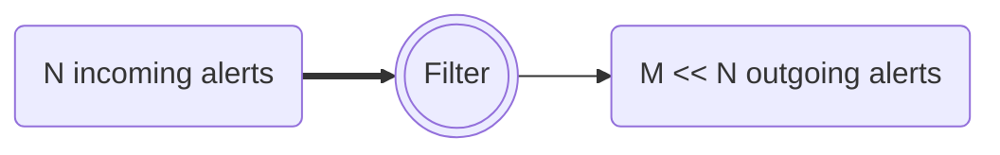

# Fink filters

Each night, telescopes are sending raw alerts and the broker enriches these alerts by adding new information to identify interesting candidates for follow-up observations or further scientific processing. The raw incoming stream volume is huge, and each user might want to focus only on a subset of the stream. Hence the output of the broker contains filters that flag only particular parts of the stream to be distributed. Criteria are based on the [alert entries](https://zwickytransientfacility.github.io/ztf-avro-alert/schema.html): position, flux, properties, ... and [Fink added values](../science/added_values.md) as filters act after science modules are applied.

<!-- 
 -->

Note that if the filters reduce the size of the stream, they do not filter the content of alerts, i.e. you will receive the full information of alerts distributed.

## Available topics

Each stream subset from a particular filter is identified by a topic name. This stream can be accessed outside via its topic, and several users can poll the data from the same topic (see [fink-client](https://github.com/astrolabsoftware/fink-client)).

Below we summarise the default Fink topics:

| Name | Link | Contents | Status |
|:--------|:-------|:--------|:--------|
| `fink_early_sn_candidates_ztf` | [early_sn_candidates](https://github.com/astrolabsoftware/fink-filters/blob/master/fink_filters/filter_early_sn_candidates/filter.py) | Return alerts considered as Early SN-Ia candidates. The data from this topic is pushed to TNS every night. | deployed |
| `fink_sn_candidates_ztf` | [sn_candidates](https://github.com/astrolabsoftware/fink-filters/blob/master/fink_filters/filter_sn_candidates/filter.py) | Return alerts considered as SN candidates | deployed |
| `fink_sso_ztf_candidates_ztf` | [sso_ztf_candidates](https://github.com/astrolabsoftware/fink-filters/blob/master/fink_filters/filter_sso_ztf_candidates/filter.py) | Return alerts with a counterpart in the Minor Planet Center database (Solar System Objects) | deployed |
| `fink_sso_fink_candidates_ztf` | [sso_fink_candidates](https://github.com/astrolabsoftware/fink-filters/blob/master/fink_filters/filter_fink_ztf_candidates/filter.py) | Return alerts considered as new Solar System Object candidates | deployed |
| `fink_kn_candidates_ztf` | [kn_candidates](https://github.com/astrolabsoftware/fink-filters/blob/master/fink_filters/filter_kn_candidates/filter.py) | Return alerts considered as Kilonova candidates based on Machine Learning | deployed |
| `fink_early_kn_candidates_ztf` | [early_kn_candidates](https://github.com/astrolabsoftware/fink-filters/blob/master/fink_filters/filter_early_kn_candidates/filter.py) | Return alerts considered as Kilonova candidates based on crossmatch and property cuts | deployed |
| `fink_rate_based_kn_candidates_ztf` | [rate_based_kn_candidates](https://github.com/astrolabsoftware/fink-filters/blob/master/fink_filters/filter_rate_based_kn_candidates/filter.py) | Return alerts considered as Kilonova candidates following Andreoni et al. 2021 (https://arxiv.org/abs/2104.06352) | deployed |
| `fink_microlensing_candidates_ztf` | [microlensing_candidates](https://github.com/astrolabsoftware/fink-filters/blob/master/fink_filters/filter_microlensing_candidates/filter.py) | Return alerts considered as microlensing candidates | deployed |
| `fink_blazar_ztf` | [blazar](https://github.com/astrolabsoftware/fink-filters/blob/master/fink_filters/filter_blazar/filter.py) | Return alerts flagged as `Blazar`, `Blazar_Candidate`, `BLLac`, or `BLLac_Candidate` in the SIMBAD database. | deployed |
| `fink_simbad_ztf` | [simbad](https://github.com/astrolabsoftware/fink-filters/blob/master/fink_filters/filter_simbad_candidates/filter.py) | Return all alerts with a counterpart in the SIMBAD database. See left column of http://simbad.u-strasbg.fr/simbad/sim-display?data=otypes for more information | available on demand |
| `fink_<single-simbad-type>_ztf` | Example [rrlyr](https://github.com/astrolabsoftware/fink-filters/blob/master/fink_filters/filter_rrlyr/filter.py) | Return alerts matching one specific type in the SIMBAD database. See left column of http://simbad.u-strasbg.fr/simbad/sim-display?data=otypes for more information | available on demand |
| `fink_grb_bronze` | [MM module](https://github.com/astrolabsoftware/fink-filters/blob/master/fink_filters/filter_mm_module/filter.py) | Alerts with a real bogus (rb) above 0.7, classified by Fink as an extragalactic event within the error location of a GRB event. |
| `fink_grb_silver` | [MM module](https://github.com/astrolabsoftware/fink-filters/blob/master/fink_filters/filter_mm_module/filter.py) | Alerts satisfying the bronze filter with a `grb_proba` above 5 sigma. |
| `fink_grb_gold` | [MM module](https://github.com/astrolabsoftware/fink-filters/blob/master/fink_filters/filter_mm_module/filter.py) | Alerts satisfying the silver filter with a `mag_rate` above 0.3 mag/day and a `rb` above 0.9. |
| `fink_gw_bronze` | [MM module](https://github.com/astrolabsoftware/fink-filters/blob/master/fink_filters/filter_mm_module/filter.py) | Alerts with a real bogus (`rb`) above 0.7, classified by Fink as an extragalactic event within the error location of a GW event. |

We also have many internal ones focusing on specific parts of the stream. Feel free also to propose new topics! The topic data is stored for 4 days after creation (i.e. you can access alert data up to 4 days after it has been emitted).
