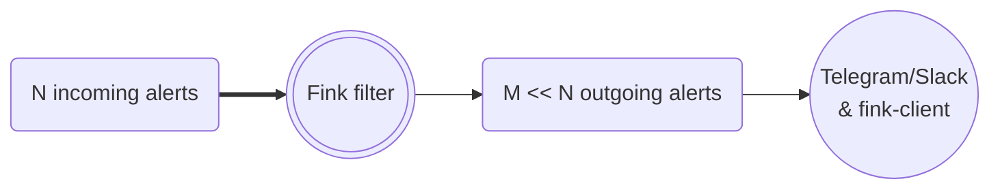
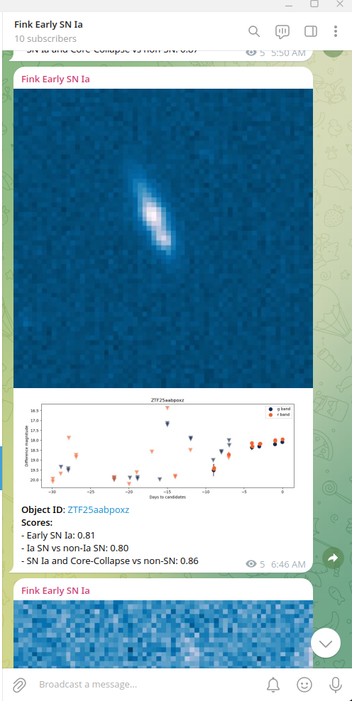

# Fink filters

Each night, telescopes are sending raw alerts and the broker enriches these alerts by adding new information to identify interesting candidates for follow-up observations or further scientific processing. The raw incoming stream volume is huge, and each user might want to focus only on a subset of the stream. Hence the output of the broker contains filters that flag only particular parts of the stream to be distributed. Criteria are based on the [alert entries](https://zwickytransientfacility.github.io/ztf-avro-alert/schema.html): position, flux, properties, ... and added values from the [Fink science modules](science_modules.md) as filters act after science modules are applied.

<!-- 
 -->

Note that if the filters reduce the size of the stream, they do not filter the content of alerts, i.e. you will receive the full information of alerts distributed.

## Available topics

### Real-time filters

As we process alerts, interesting alerts are automatically picked up by filters and [Apache Kafka](https://kafka.apache.org/) queues are populated. Each stream subset from a particular filter is identified by a topic name. This stream can be accessed outside via its topic, and several users can poll the data from the same topic. All topics can be accessed using the [Fink client](https://github.com/astrolabsoftware/fink-client), which is a wrapper around Kafka consumer functionalities.

In addition, for some filters, we redirect the data to instant messaging services such as Telegram or Slack (just ask for it if you need!). Below we summarise the widely used Fink topics, with their availability on Slack and Telegram (for Telegram, you can directly subscribe using the link):

| Name | Content | Slack bot (fink-broker workspace) | TG bot (public) |
|:--------|:-------|:--------|:--------|
| [fink_early_sn_candidates_ztf](https://github.com/astrolabsoftware/fink-filters/blob/master/fink_filters/filter_early_sn_candidates/filter.py) | Return alerts considered as Early SN-Ia candidates. The data from this topic is pushed to TNS every night. | #bot_tns | [Fink Early SN Ia](https://t.me/fink_early_ia) |
| [fink_sn_candidates_ztf](https://github.com/astrolabsoftware/fink-filters/blob/master/fink_filters/filter_sn_candidates/filter.py) | Return alerts considered as SN candidates | -- | -- |
| [fink_sso_ztf_candidates_ztf](https://github.com/astrolabsoftware/fink-filters/blob/master/fink_filters/filter_sso_ztf_candidates/filter.py) | Return alerts with a counterpart in the Minor Planet Center database (Solar System Objects) | -- | -- |
| [fink_sso_fink_candidates_ztf](https://github.com/astrolabsoftware/fink-filters/blob/master/fink_filters/filter_fink_ztf_candidates/filter.py) | Return alerts considered as new Solar System Object candidates | -- | -- |
| [fink_kn_candidates_ztf](https://github.com/astrolabsoftware/fink-filters/blob/master/fink_filters/filter_kn_candidates/filter.py) | Return alerts considered as Kilonova candidates based on Machine Learning | #bot_kilonova-candidates | -- |
| [fink_early_kn_candidates_ztf](https://github.com/astrolabsoftware/fink-filters/blob/master/fink_filters/filter_early_kn_candidates/filter.py) | Return alerts considered as Kilonova candidates based on crossmatch and property cuts | #bot_kilonova-candidates | -- |
| [fink_rate_based_kn_candidates_ztf](https://github.com/astrolabsoftware/fink-filters/blob/master/fink_filters/filter_rate_based_kn_candidates/filter.py) | Return alerts considered as Kilonova candidates following Andreoni et al. 2021 (https://arxiv.org/abs/2104.06352) | #bot_kilonova-candidates | -- |
| [fink_microlensing_candidates_ztf](https://github.com/astrolabsoftware/fink-filters/blob/master/fink_filters/filter_microlensing_candidates/filter.py) | Return alerts considered as microlensing candidates | -- | -- |
| [fink_blazar_ztf](https://github.com/astrolabsoftware/fink-filters/blob/master/fink_filters/filter_blazar/filter.py) | Return alerts flagged as `Blazar`, `Blazar_Candidate`, `BLLac`, or `BLLac_Candidate` in the SIMBAD database. | -- | -- |
| [fink_yso_spicy_candidates_ztf](https://github.com/astrolabsoftware/fink-filters/blob/master/fink_filters/filter_yso_spicy_candidates/filter.py) | Return alerts alerts with a match in the [SPICY catalog](https://vizier.cds.unistra.fr/viz-bin/VizieR-3?-source=J/ApJS/254/33/table1) hosted at CDS. | -- | [Fink SPICY](https://t.me/spicy_fink) |
| [fink_grb_bronze](https://github.com/astrolabsoftware/fink-filters/blob/master/fink_filters/filter_mm_module/filter.py) | Alerts with a real bogus (rb) above 0.7, classified by Fink as an extragalactic event within the error location of a GRB event. | -- | -- |
| [fink_grb_silver](https://github.com/astrolabsoftware/fink-filters/blob/master/fink_filters/filter_mm_module/filter.py) | Alerts satisfying the bronze filter with a `grb_proba` above 5 sigma. | -- | -- |
| [fink_grb_gold](https://github.com/astrolabsoftware/fink-filters/blob/master/fink_filters/filter_mm_module/filter.py) | Alerts satisfying the silver filter with a `mag_rate` above 0.3 mag/day and a `rb` above 0.9. | -- | -- |
| [fink_gw_bronze](https://github.com/astrolabsoftware/fink-filters/blob/master/fink_filters/filter_mm_module/filter.py) | Alerts with a real bogus (`rb`) above 0.7, classified by Fink as an extragalactic event within the error location of a GW event. | -- | -- |

_Example of the Early SN Ia Telegram bot_

Feel free also to propose new topics! The topic data is stored for 4 days after creation (i.e. you can access alert data up to 4 days after it has been emitted).

### After the night filters

Some filtering operations do not require real-time, or require the need for the full night data to select interesting alerts (e.g. sorting alerts based on a score, and selecting the top-10). These filters are typically run a few hours after the observing night has ended.

| Name | Content | Slack bot (fink-broker workspace) | TG bot (public) |
|:--------|:-------|:--------|:--------|
| [Known TDE](https://github.com/astrolabsoftware/fink-filters/blob/master/fink_filters/filter_known_tde/filter.py) | Return alerts matching with known TDEs | #bot_known_tde_follow_up | -- |
| [Anomaly detection](https://github.com/astrolabsoftware/fink-filters/blob/master/fink_filters/filter_anomaly_notification/filter.py) | Return alerts with highest anomaly scores each night (top 10) | #bot_anomaly | [Fink anomaly bot](https://t.me/ZTF_anomaly_bot) |
| [Active Learning for SN Ia](https://github.com/astrolabsoftware/fink-broker/blob/master/bin/active_learning_loop.py) | Return alerts with SN Ia probability close to 0.5 for active learning studies. | #bot_al_loop | -- |
| [Dwarf AGN](https://github.com/astrolabsoftware/fink-filters/blob/master/fink_filters/filter_dwarf_agn/filter.py) | Return alerts matching with custom catalog of dwarf AGN. | #bot_manga | -- |
| [Hostless transients](https://github.com/astrolabsoftware/fink-broker/blob/master/bin/hostless_detection.py) | Return hostless alert candidates from the [ELEPHANT](https://arxiv.org/abs/2404.18165) pipeline. | -- | [Fink Hostless](https://t.me/fink_hostless) |
