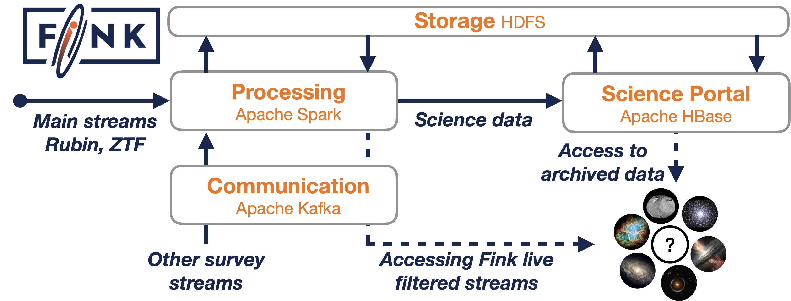

**Broker:** [](https://sonarcloud.io/dashboard?id=finkbroker)
[](https://sonarcloud.io/dashboard?id=finkbroker)
[](https://github.com/astrolabsoftware/fink-broker/actions?query=workflow%3ASentinel)
[](https://github.com/astrolabsoftware/fink-broker/actions?query=workflow%3APEP8)
[](https://codecov.io/gh/astrolabsoftware/fink-broker)

## The magic behind Fink



Fink is mainly based on the recent [Spark Structured Streaming](https://spark.apache.org/docs/latest/structured-streaming-programming-guide.html) module introduced in Spark 2.0 (see [paper](https://cs.stanford.edu/~matei/papers/2018/sigmod_structured_streaming.pdf)), and especially its integration with Apache Kafka (see [here](https://spark.apache.org/docs/latest/structured-streaming-kafka-integration.html)). Structured streaming is a stream processing engine built on the Spark SQL engine, hence it combines the best of the two worlds.
The idea behind it is to process data streams as a series of small batch jobs, called micro-batch processing. As anything in Spark, it provides fast, scalable, fault-tolerant processing, plus end-to-end exactly-once stream processing.

## Broker structure

The broker is made of 4 modules:

* **stream2raw**: connect to incoming stream of alerts, and archive data on disk.
* **raw2science**: filter out bad quality alerts, and add values to remaining alerts using the user-defined science modules.
* **distribution**: redistribute alerts to users based on user-defined filters (Kafka topics).
* **archive**: store alerts containing scientific added values.

On the production platform, we typically have several medium-size clusters spun-up: Apache Spark, Apache Kafka, Apache HBase, ... but you can install and test all of these components in local mode, with moderate resources required.

## Installation and general tests (experts only)

Installing Fink is not too complicated but might be an overwhelming task. Fink can be a complex system, but hopefully it is highly modular such that you do not need all the parts to test one part in particular. If you want to test it fully though, we recommend using the available Docker images, which contain all you need to start (Apache Spark, Apache Kafka, Apache HBase, plus Fink components). You can find these either in the [fink-docker](https://github.com/astrolabsoftware/fink-docker) repository (soon deprecated), or in the [fink-broker](https://github.com/astrolabsoftware/fink-broker/blob/master/doc/devel.adoc) repository (kubernetes support as well)


### Running the test suite with Docker

In general, you can follow what is done for the [continuous integration](https://github.com/astrolabsoftware/fink-broker/blob/master/.github/workflows/test.yml). Once the image is pulled, you need to set the `PYTHONPATH` and `PATH` to use the tools:

```bash
# in your ~/.bash_profile
export FINK_HOME=/path/to/fink-broker
export PYTHONPATH=$FINK_HOME:$PYTHONPATH
export PATH=$FINK_HOME/bin:$PATH
```

The fink-broker repository contains some alerts from the ZTF experiment required for the test suite in the folder `datasim`. If you need to download more alerts data, go to the datasim directory and execute the download script:

```bash
cd datasim
./download_ztf_alert_data.sh
cd ..
```

Make sure the test suite is running fine. Just execute:

```bash
fink_test [--without-integration] [-h]
```

You should see plenty of Spark logs (and yet we have shut most of them!), but no failures hopefully! Success is silent, and the coverage is printed on screen at the end. You can disable integration tests by specifying the argument `--without-integration`. Note for docker users: you need to install fink-science and fink-filters (either mounted inside the container, or installed via pip) prior running the test suite. See above for more information.

### Tests with Kubernetes

To come.