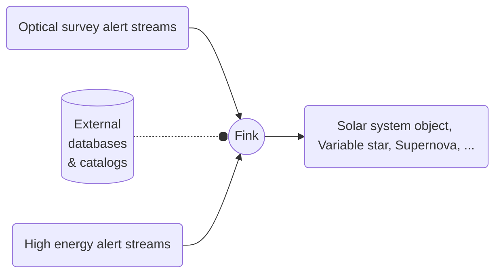

# Science Roadmap

!!! tip "Science Goal"
	Fink's primary scientific goal is to maximize the scientific impact of the Rubin alert data stream. Rather than focusing on a specific area, our ambition is to explore the transient and variable sky as a whole, encompassing everything from Solar system objects to galactic and extragalactic phenomena. We currently focus on several areas:

	* Impact of man-made objects, such as satellites or debris orbiting around the Earth
	* Solar System objects
	* Microlensing: compact objects, exoplanets, ...
	* Young stellar objects
	* Supernovae: Ia, but not only!
	* Pair-instability Supernovae
	* Active galactic nuclei
	* Multi-messenger astronomy: Gamma Ray Bursts, gamma ray, X, gravitational waves counterparts, neutrino, ...
	* Anomaly detection: unravelling the unknown

<!-- 
 -->

Each night, telescopes and surveys are sending alerts when they detect changes in the luminosity of astronomical objects. These alerts contain minimal information such as sky location, flux of the transient, and sometimes historical data at this location. The main role of Fink is to enrich these alerts with additional information to identify interesting candidates for follow-up observations or further scientific processing. In Fink, this additional information is provided by the broker services (e.g. identification from the CDS cross-match service) and by user-defined science modules (e.g. machine learning classification, or feature extraction algorithms).

## ZTF alert stream

Since 2019, we are operating on the [ZTF](https://www.ztf.caltech.edu/) public alert stream, which has constituted an excellent opportunity to engage projects with the scientific community while preparing the ground for the upcoming Rubin Observatory alert data. Have a look at the [publication list](https://fink-broker.org/papers/) for example, or the [SN Ia candidates](https://www.wis-tns.org/search?&discovered_period_value=1&discovered_period_units=years&unclassified_at=0&classified_sne=0&include_frb=0&name=&name_like=0&isTNS_AT=all&public=all&ra=&decl=&radius=&coords_unit=arcsec&reporting_groupid%5B%5D=null&groupid%5B%5D=null&classifier_groupid%5B%5D=null&objtype%5B%5D=null&at_type%5B%5D=null&date_start%5Bdate%5D=&date_end%5Bdate%5D=&discovery_mag_min=&discovery_mag_max=&internal_name=&discoverer=Fink&classifier=&spectra_count=&redshift_min=&redshift_max=&hostname=&ext_catid=&ra_range_min=&ra_range_max=&decl_range_min=&decl_range_max=&discovery_instrument%5B%5D=null&classification_instrument%5B%5D=null&associated_groups%5B%5D=null&official_discovery=0&official_classification=0&at_rep_remarks=&class_rep_remarks=&frb_repeat=all&frb_repeater_of_objid=&frb_measured_redshift=0&frb_dm_range_min=&frb_dm_range_max=&frb_rm_range_min=&frb_rm_range_max=&frb_snr_range_min=&frb_snr_range_max=&frb_flux_range_min=&frb_flux_range_max=&num_page=50&display%5Bredshift%5D=1&display%5Bhostname%5D=1&display%5Bhost_redshift%5D=1&display%5Bsource_group_name%5D=1&display%5Bclassifying_source_group_name%5D=1&display%5Bdiscovering_instrument_name%5D=0&display%5Bclassifing_instrument_name%5D=0&display%5Bprograms_name%5D=0&display%5Binternal_name%5D=1&display%5BisTNS_AT%5D=0&display%5Bpublic%5D=1&display%5Bend_pop_period%5D=0&display%5Bspectra_count%5D=1&display%5Bdiscoverymag%5D=1&display%5Bdiscmagfilter%5D=1&display%5Bdiscoverydate%5D=1&display%5Bdiscoverer%5D=1&display%5Bremarks%5D=0&display%5Bsources%5D=0&display%5Bbibcode%5D=0&display%5Bext_catalogs%5D=0) sent every night to the Transient Name Server!

The ZTF alert data is an unfiltered, 5-sigma alert stream, and you can find all information about the content [here](https://zwickytransientfacility.github.io/ztf-avro-alert/). Alerts are coming from all over the sky, and here is for example a projection on the sky of alerts from 2019 to 2021:

In this context we also have strong partnerships with other missions (e.g. [SVOM](https://www.svom.eu/en/home/)) or network of telescopes (e.g. [GRANDMA](https://grandma.ijclab.in2p3.fr/)). We are open to contributions in those science cases, but also to new contributions that are not listed here. If you have a science proposal and you would like to integrate it with the broker, contact [us](mailto:contact@fink-broker.org).

## Rubin Observatory

The Rubin Observatory is expected to start operations at the beginning of 2025. Recently, it [disclosed](https://www.lsst.org/scientists/alert-brokers) the Community brokers that will have unrestricted access to the complete alert stream for the next decade: [ALeRCE](https://alerce.science/), [AMPEL](https://github.com/AmpelProject), [ANTARES](https://antares.noirlab.edu/), BABAMUL, [Fink](https://fink-broker.org), [Lasair](https://lasair.roe.ac.uk/), and [Pitt-Google](https://github.com/mwvgroup/Pitt-Google-Broker). In the meantime, we are participating for example to the [DESC-ELAsTiCC alert challenge](https://portal.nersc.gov/cfs/lsst/DESC_TD_PUBLIC/ELASTICC/) to prepare for the deluge of data!
