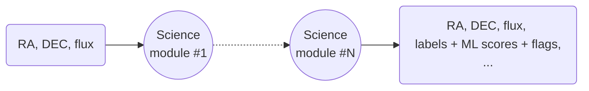

# Fink science modules

In addition to the information contained in the incoming raw alerts, Fink deploys science modules whose task is to add further details to better characterise the event.

<!-- 
 -->

The science modules are provided by the scientific community and encompass a dozen modules that focus on a wide range of scientific cases, from Solar System science to galactic and extragalactic studies. These modules can share information, allowing the input of one module to utilize the output of one or more other modules.

!!! info "Open source and open data"
	Each science module provides added values in form of extra fields inside the alert packet, and these fields are freely accessible by anyone. The code sources of science modules can be found at [https://github.com/astrolabsoftware/fink-science](https://github.com/astrolabsoftware/fink-science).

## ZTF science modules

Below we summarise the fields added by the Fink/ZTF science modules.

### Cross-match

For each alert, we look for counterparts in various databases or catalogs (spatial match). Note that ZTF already performs associations with Gaia DR1, PanSTARRS, and the Minor Planet Center.

| Field in Fink alerts | Type | Contents | Available from |
|:-----|:-------|:--------|:---------|
|`cdsxmatch` | string | Counterpart (cross-match) from the SIMBAD database using the [CDS xmatch service](http://cdsxmatch.u-strasbg.fr/xmatch) if exists within 1.5 arcsec. Labels can be found at [http://simbad.u-strasbg.fr/simbad/sim-display?data=otypes](http://simbad.u-strasbg.fr/simbad/sim-display?data=otypes) | 2019/11 |
| `gcvs` | string | Counterpart (cross-match) to the [General Catalog of Variable Stars](http://www.sai.msu.su/groups/cluster/gcvs/gcvs/) if exists within 1.5 arcsec. | 2022/07 |
| `vsx` | string | Counterpart (cross-match) to the [International Variable Star Index](https://www.aavso.org/vsx/) if exists within 1.5 arcsec. | 2022/07 |
| `Plx` | float | Absolute stellar parallax (in milli-arcsecond) of the closest source from Gaia catalog; if exists within 1 arcsec. | 2022/07 |
| `e_Plx` | float | Standard error of the stellar parallax (in milli-arcsecond) of the closest source from Gaia catalog; if exists within 1 arcsec. | 2022/07 |
| `DR3Name` | string | Unique source designation of closest source from Gaia catalog; if exists within 1 arcsec. | 2022/07 |
| `x4lac` | string | Counterpart (cross-match) to the [4LAC DR3](https://fermi.gsfc.nasa.gov/ssc/data/access/lat/4LACDR3/) catalog if exists within 1 arcminute. | 2023/01 |
| `x3hsp` | string | Counterpart (cross-match) to the [3HSP](https://www.ssdc.asi.it/3hsp/) catalog if exists within 1 arcminute. | 2023/01 |
| `mangrove` | dic[str, str] | Counterpart (cross-match) to the [Mangrove](https://mangrove.lal.in2p3.fr/index.php) catalog if exists within 1 arcminute. | 2023/01 |
| `spicy_id` | int | Unique source designation of closest source from the [SPICY catalog](https://vizier.cds.unistra.fr/viz-bin/VizieR-3?-source=J/ApJS/254/33/table1) hosted at CDS; if exists within 1.2 arcsec. | 2024/01 |
| `spicy_class` | str | Class name of closest source from the [SPICY catalog](https://vizier.cds.unistra.fr/viz-bin/VizieR-3?-source=J/ApJS/254/33/table1) hosted at CDS; if exists within 1.2 arcsec. | 2024/01 |

Please feel free to suggest any other catalogs. If they are available at CDS, we can integrate them directly. For external catalogs, depending on their size, we can consider hosting them ourselves.

!!! warning "Fail XXX"
    If there is a failure with the xmatch service from CDS, the fields can have values `Fail XXX`. `XXX` is a 3-digit number corresponding to the failure type (see [HTTP status codes](https://en.wikipedia.org/wiki/List_of_HTTP_status_codes)). Note that the next time the object emits an alert, if the xmatch service is up, these values will be updated with their correct values.

### Machine and deep learning

In Fink, you can upload pre-trained models, and each alert will receive a score. We have binary models focusing on specific class of transients (e.g. SN Ia vs the rest of the world), or broad classifiers that output a vector of probabilities for a variety of classes.

| Field in Fink alerts | Type | Contents | Available from |
|:-----|:-------|:--------|:---------|
| `rf_snia_vs_nonia` | float | Probability to be a rising SNe Ia based on Random Forest classifier (1 is SN Ia). Based on [2111.11438](https://arxiv.org/abs/2111.11438) | 2019/11 |
| `snn_snia_vs_nonia` | float | Probability to be a SNe Ia based on [SuperNNova](https://supernnova.readthedocs.io/en/latest/) classifier (1 is SN Ia). Based on https://arxiv.org/abs/1901.06384 | 2019/11 |
| `snn_sn_vs_all` | float | Probability to be a SNe based on [SuperNNova](https://supernnova.readthedocs.io/en/latest/) classifier (1 is SNe). Based on https://arxiv.org/abs/1901.06384 | 2019/11 |
| `mulens`| float | Probability score to be a microlensing event by [LIA](https://github.com/dgodinez77/LIA) | 2019/11 |
| `rf_kn_vs_nonkn` | float | Probability of an alert to be a kilonova using a Random Forest Classifier (1 is KN). Based on [2210.17433](https://arxiv.org/abs/2210.17433).| 2019/11 |
| `t2` | dic[str, float] | Vector of probabilities (class, prob) using Transformers ([arxiv:2105.06178](https://arxiv.org/abs/2105.06178)) | 2023/01 |
| `lc_*` | dict[int, array<double>] | Numerous [light curve features](https://arxiv.org/pdf/2012.01419.pdf#section.A1) used in astrophysics. | 2023/01 |
| `anomaly_score` | float | Probability of an alert to be anomalous (lower values mean more anomalous observations) based on `lc_*` | 2023/01 |

### Standard modules

Standard modules typically issue flags or aggregated information to ease the processing later.

| Field in Fink alerts | Type | Contents | Available from |
|:-----|:-------|:--------|:---------|
| `roid` | int | Determine if the alert is a Solar System object | 2019/11 |
| `nalerthist` | int | Number of detections contained in each alert (current+history). Upper limits are not taken into account. | 2019/11 |
| `jd_first_real_det` | double | first variation time at 5 sigma contains in the alert history | 2023/12 |
| `jdstarthist_dt` | double | delta time between `jd_first_real_det` and the first variation time at 3 sigma (`jdstarthist`). If `jdstarthist_dt` > 30 days then the first variation time at 5 sigma is False (accurate for fast transient). | 2023/12 |
| `mag_rate` | double | magnitude rate (mag/day) | 2023/12 |
| `sigma_rate` | double | magnitude rate error estimation (mag/day) | 2023/12 |
| `lower_rate` | double | 5% percentile of the magnitude rate sampling used for the error computation (`sigma_rate`) | 2023/12 |
| `upper_rate` | double | 95% percentile of the magnitude rate sampling used for the error computation (`sigma_rate`) | 2023/12 |
| `delta_time` | double | delta time between the the two measurement used for the magnitude rate `mag_rate` | 2023/12 |
| `from_upper` | bool | if True, the magnitude rate `mag_rate` has been computed using the last upper limit and the current measurement | 2023/12 |

### Post-processing modules

There are also modules applied after the observing night:

| Field name | Type | Contents | Available from |
|:-----|:-------|:--------|:---------|
| `tracklet` | string | Tracklet ID in the Fink database. Tracklets are typically  derelict satellites or rocket bodies, collision debris, or spacecraft payloads. See [2202.05719](https://arxiv.org/pdf/2202.05719) and [2310.17322](https://arxiv.org/pdf/2310.17322) for more information. | 2020/08 |
| `kstest_static` | float | Determine if an alert is hostless (based on [2404.18165](https://arxiv.org/abs/2404.18165)) | 2024/07

## DESC-ELAsTiCC science modules

These modules are being tested for Rubin era on the LSST-DESC ELAsTiCC data challenge:

| Field in Fink alerts | Type | Contents |
|:-----|:-------|:--------|
| `rf_agn_vs_nonagn` | float | Probability to be an AGN based on Random Forest classifier (1 is AGN). |
| `rf_snia_vs_nonia` | float | Probability to be a rising SNe Ia based on Random Forest classifier (1 is SN Ia). Based on https://arxiv.org/abs/2111.11438 |
| `snn_snia_vs_nonia` | float | Probability to be a SNe Ia based on [SuperNNova](https://supernnova.readthedocs.io/en/latest/) classifier (1 is SN Ia). Based on https://arxiv.org/abs/1901.06384 |
| `preds_snn` | array[float] | Broad classifier based on SNN. Returns [class, max(prob)]. |
| `cbpf_preds` | array[float] | Fine classifier based on the CBPF Algorithm for Transient Search. Returns [class, max(prob)]. |

## LSST science modules

To come!
