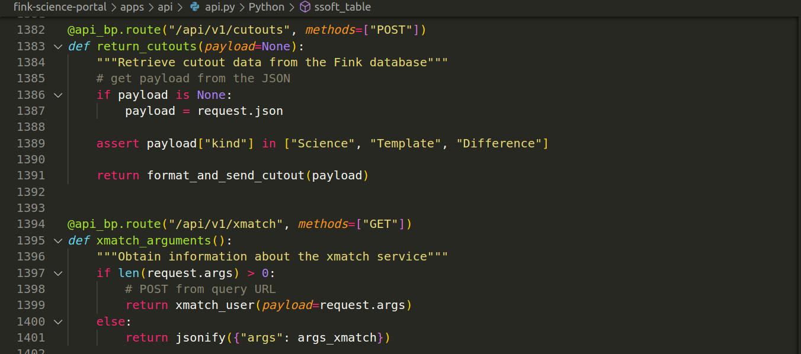

# Fink services

Now that we discussed the various components of Fink, it is time to access the data! We expose several services for the community. They all serve different purpose:

-   __Science Portal__

    ---

    The [Science Portal](https://fink-portal.org) is a web application that allows you to perform visualisation of aggregated data in Fink, run simple queries. It is best for daily inspection. Data source is from the Fink Database, and new data is available a few hours after the observing night has finished. No login required.

    

-   __REST API__

    ---

    The [REST API](../services/search/getting_started.md) allows you to access programmatically the processed data in Fink. It is used under the hood by the Science Portal, although it enables more. You can run simple queries, and it is best for automated workflows. Data source is from the Fink Database, and new data is available a few hours after the observing night has finished. No login required.

    

-   __Livestream__

    ---

    The [Livestream service](../services/livestream.md) allows you to access alert data (not aggregated objects) selected by [Fink filters](filters.md) in real-time. It enables real-time analyses, automated workflows, and it is best for rapid follow-up observations. Data source is Fink Data Lake (different from the Database). Login required (see [fink-client](https://github.com/astrolabsoftware/fink-client)), except if you are using an instant messaging services such as Telegram or Slack.

-   __Data Transfer__

    ---

    The [Data Transfer service](../services/data_transfer.md) allows you to perform bulk download of alert data (not aggregated objects), run complex queries, and exotic analyses. Data source is from the Fink Data Lake (different from the Database), and new data is available a few hours after the observing night has finished. Login required (see [fink-client](https://github.com/astrolabsoftware/fink-client)).

