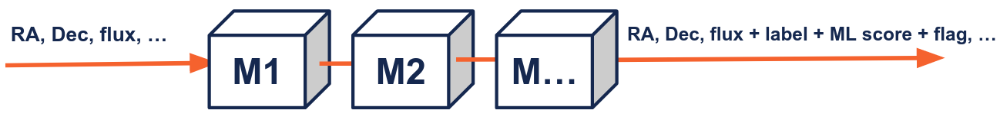

[](https://pypi.python.org/pypi/fink-science)
[](https://github.com/astrolabsoftware/fink-science/actions?query=workflow%3ASentinel)
[](https://github.com/astrolabsoftware/fink-science/actions?query=workflow%3APEP8)
[](https://codecov.io/gh/astrolabsoftware/fink-science)

# Fink science modules

In addition to the information contained in the incoming raw alerts (see [ZTF alerts schema](https://zwickytransientfacility.github.io/ztf-avro-alert/schema.html)), Fink deploys science modules whose task is to add additional information to characterise the event.



The science modules are provided by the community of experts, and they focus on different parts of the stream. Science modules are independent, but they can also share information in a way that the input of a science module can use the output of one or several other modules.

## ZTF science modules

Each science module provides added values in form of extra fields inside the alert packet, and these fields are accessible the same way as any other fields at the end of the processing. All science modules code source can be found at [https://github.com/astrolabsoftware/fink-science](https://github.com/astrolabsoftware/fink-science). Below we summarise the fields added by the Fink science modules.

### Crossmatch

For each alert, we look for counterparts in various databases or catalogs (spatial match). Note that ZTF already performs associations with Gaia DR1, PanSTARRS, and the Minor Planet Center.

| Field in Fink alerts | Type | Contents | Available from |
|:-----|:-------|:--------|:---------|
|`cdsxmatch` | string | Counterpart (cross-match) from any CDS catalog or database using the [CDS xmatch service](http://cdsxmatch.u-strasbg.fr/xmatch) if exists within 1.5 arcsec. | 2019/11 |
| `gcvs` | string | Counterpart (cross-match) to the [General Catalog of Variable Stars](http://www.sai.msu.su/groups/cluster/gcvs/gcvs/) if exists within 1.5 arcsec. | 2022/07 |
| `vsx` | string | Counterpart (cross-match) to the [International Variable Star Index](https://www.aavso.org/vsx/) if exists within 1.5 arcsec. | 2022/07 |
| `Plx` | float | Absolute stellar parallax (in milli-arcsecond) of the closest source from Gaia catalog; if exists within 1 arcsec. | 2022/07 |
| `e_Plx` | float | Standard error of the stellar parallax (in milli-arcsecond) of the closest source from Gaia catalog; if exists within 1 arcsec. | 2022/07 |
| `DR3Name` | string | Unique source designation of closest source from Gaia catalog; if exists within 1 arcsec. | 2022/07 |
| `x4lac` | string | Counterpart (cross-match) to the [4LAC DR3](https://fermi.gsfc.nasa.gov/ssc/data/access/lat/4LACDR3/) catalog if exists within 1 arcminute. | 2023/01 |
| `x3hsp` | string | Counterpart (cross-match) to the [3HSP](https://www.ssdc.asi.it/3hsp/) catalog if exists within 1 arcminute. | 2023/01 |
| `mangrove` | dic[str, str] | Counterpart (cross-match) to the [Mangrove](https://mangrove.lal.in2p3.fr/index.php) catalog if exists within 1 arcminute. | 2023/01 |

### Machine and deep learning

In Fink, you can upload pre-trained models, and each alert will receive a score. We have binary models focusing on specific class of transients (e.g. SN Ia vs the rest of the world), or broad classifier that output a vector of probabilities for a variety of classes.

| Field in Fink alerts | Type | Contents | Available from |
|:-----|:-------|:--------|:---------|
| `rf_snia_vs_nonia` | float | Probability to be a rising SNe Ia based on Random Forest classifier (1 is SN Ia). Based on https://arxiv.org/abs/2111.11438 | 2019/11 |
| `snn_snia_vs_nonia` | float | Probability to be a SNe Ia based on [SuperNNova](https://supernnova.readthedocs.io/en/latest/) classifier (1 is SN Ia). Based on https://arxiv.org/abs/1901.06384 | 2019/11 |
| `snn_sn_vs_all` | float | Probability to be a SNe based on [SuperNNova](https://supernnova.readthedocs.io/en/latest/) classifier (1 is SNe). Based on https://arxiv.org/abs/1901.06384 | 2019/11 |
| `mulens`| float | Probability score to be a microlensing event by [LIA](https://github.com/dgodinez77/LIA) | 2019/11 |
| `rf_kn_vs_nonkn` | float | Probability of an alert to be a kilonova using a Random Forest Classifier (binary classification). | 2019/11 |
| `t2` | dic[str, float] | Vector of probabilities (class, prob) using Transformers ([arxiv:2105.06178](https://arxiv.org/abs/2105.06178)) | 2023/01 |
| `lc_*` | dict[int, array<double>] | Numerous [light curve features](https://arxiv.org/pdf/2012.01419.pdf#section.A1) used in astrophysics. | 2023/01 |
| `anomaly_score` | float | Probability of an alert to be anomalous (lower values mean more anomalous observations) based on `lc_*` | 2023/01 |

### Standard modules

Standard modules typically issue flags or aggregated information to ease the processing later.

| Field in Fink alerts | Type | Contents | Available from |
|:-----|:-------|:--------|:---------|
| `roid` | int | Determine if the alert is a Solar System object | 2019/11 |
| `nalerthist` | int | Number of detections contained in each alert (current+history). Upper limits are not taken into account. | 2019/11 |
| `tracklet` | str | ID for fast moving objects, typically orbiting around the Earth. Of the format `YYYY-MM-DD hh:mm:ss` | 2020/08 |
| `jd_first_real_det` | double | first variation time at 5 sigma contains in the alert history | 2023/12 |
| `jdstarthist_dt` | double | delta time between `jd_first_real_det` and the first variation time at 3 sigma (`jdstarthist`). If `jdstarthist_dt` > 30 days then the first variation time at 5 sigma is False (accurate for fast transient). | 2023/12 |
| `mag_rate` | double | magnitude rate (mag/day) | 2023/12 |
| `sigma_rate` | double | magnitude rate error estimation (mag/day) | 2023/12 |
| `lower_rate` | double | 5% percentile of the magnitude rate sampling used for the error computation (`sigma_rate`) | 2023/12 |
| `upper_rate` | double | 95% percentile of the magnitude rate sampling used for the error computation (`sigma_rate`) | 2023/12 |
| `delta_time` | double | delta time between the the two measurement used for the magnitude rate `mag_rate` | 2023/12 |
| `from_upper` | bool | if True, the magnitude rate `mag_rate` has been computed using the last upper limit and the current measurement | 2023/12 |

### Notes

!!! note
    There has been a name change, starting from fink-science 0.5.0:
    `rfscore` was replaced by `rf_snia_vs_nonia`, and `knscore` was replaced by `rf_kn_vs_nonkn`. Also starting from 0.5.0, there has been a type change:
    `mulens` is no more a struct, but a float. Previous data has been reprocessed.


Details can be found at [fink-science](https://github.com/astrolabsoftware/fink-science). Over time, there will be more added values available - and feel free to propose new modules! Here are some modules under development for example:

| Field in Fink alerts | Type | Contents |
|:-----|:-------|:--------|
| `rf_agn_vs_nonagn` | float | Probability to be an AGN based on Random Forest classifier (1 is AGN). |
| `GRB` | dict | TBD |

## Create your ZTF science module

This tutorial goes step-by-step for creating a science modules used to generate added values to ZTF alerts. Running entirely Fink just for testing a module might be an overwhelming task. Fink can be a complex system, but hopefully it is highly modular such that you do not need all the parts to test one part in particular. In principle, to test a module you only need Apache Spark installed, and alert data. Spark API exposes nearly the same methods for static or streaming DataFrame. Hence, to avoid complication due to streaming (e.g. creating streams with Kafka, reading streams, managing offsets, etc...), it is always best to prototype on static DataFrame. If the logic works for static, it will work for streaming.


### Set up your development environment

First make sure you are working in the correct environment. You can either use the Fink Docker images:

```bash
# pull and run the image used for ZTF processing
docker run -t -i --rm julienpeloton/fink-ci:prod bash
```

The advantage of this method is that you have everything installed in it (Python and various frameworks). Alternatively, you can install everything on your machine. For Python packages, just use a virtual environment:

```bash
conda create -n fink-env python=3.9
BASEURL=https://raw.githubusercontent.com/astrolabsoftware/fink-broker/master/deps
pip install -r $BASEURL/requirements.txt
pip install -r $BASEURL/requirements-science.txt
pip install -r $BASEURL/requirements-science-no-deps.txt
```

Then you need to install Apache Spark. If you opted for the Docker version, it is already installed for you. Otherwise just execute:

```bash
SPARK_VERSION=3.1.3
wget --quiet https://archive.apache.org/dist/spark/spark-${SPARK_VERSION}/spark-${SPARK_VERSION}-bin-${HADOOP_VERSION}.tgz
tar -xf spark-${SPARK_VERSION}-bin-${HADOOP_VERSION}.tgz
rm spark-${SPARK_VERSION}-bin-${HADOOP_VERSION}.tgz
```

and put these lines in your `~/.bash_profile`:

```bash
export SPARK_HOME=/path/to/spark-${SPARK_VERSION}-bin-${HADOOP_VERSION}
export PATH=$PATH:$SPARK_HOME/bin
export PYTHONPATH=$PYTHONPATH:$SPARK_HOME/python
```

Finally fork and clone the [fink-science](https://github.com/astrolabsoftware/fink-science) repository, and create a new folder in `fink_science/`. The name of the folder does not matter much, but try to make it meaningful as much as possible!

### Develop your science module

A module contains necessary routines and classes to process the alert data, and add values. In this simple example, we explore a simple science module that takes magnitude measurements contained in each alert, and computes the change in magnitude between the last two measurements. A full example can be found at [https://github.com/astrolabsoftware/fink-science/tree/master/tutorial](https://github.com/astrolabsoftware/fink-science/tree/master/tutorial).

A science module will typically contains two parts: the processor that contains the main routine called by Fink, and any other modules used by the processor. The processor will typically look like:

```python
from pyspark.sql.functions import pandas_udf
from pyspark.sql.types import FloatType

import pandas as pd

from mymodule import super_magic_funtion

@pandas_udf(FloatType())
def myprocessor(objectId: pd.Series, magpsf: pd.Series, anothercolumn: pd.Series) -> pd.Series:
    """ Documentation please!
    """
    # your logic goes here
    output = super_magic_funtion(*args)

    # Return a column
    return pd.Series(output)
```

Remarks:

- The use of the decorator is mandatory. It is a decorator for Apache Spark, and it specifies the output type as well as the type of operation.
- You can return only one new column (i.e. add one new information per module). However the column can be nested (i.e. containing lists or dictionaries as elements).

To test your module, you need some real data to play with. For this, you can use the Data Transfer service (a few nights are usually enough to prototype): [https://fink-portal.org/download](https://fink-portal.org/download).

### Submit your science module

Once your science module is done, open a Pull Request on the fink-science repository on GitHub, and we will review it and test it extensively before deployment. The criteria for acceptance are:

- The science module works ;-)
- The execution time is not too long.

We want to process data as fast as possible, and long running times add delay for further follow-up observations. What execution time is acceptable? It depends, but in any case communicate early the extra time overhead, and we can have a look together on how to speed-up the process if needed.

### Play!

Once your module is deployed, outgoing alerts will contain new information! You can then define your filter using [fink-filters](https://github.com/astrolabsoftware/fink-filters), and you will then be able to receive these alerts in (near) real-time using the [fink-client](https://github.com/astrolabsoftware/fink-client), or access them at any time in the Science Portal.

## DESC-ELAsTiCC science modules

These modules are being tested for Rubin era on the LSST-DESC ELAsTiCC data challenge:

| Field in Fink alerts | Type | Contents |
|:-----|:-------|:--------|
| `rf_agn_vs_nonagn` | float | Probability to be an AGN based on Random Forest classifier (1 is AGN). |
| `rf_snia_vs_nonia` | float | Probability to be a rising SNe Ia based on Random Forest classifier (1 is SN Ia). Based on https://arxiv.org/abs/2111.11438 |
| `snn_snia_vs_nonia` | float | Probability to be a SNe Ia based on [SuperNNova](https://supernnova.readthedocs.io/en/latest/) classifier (1 is SN Ia). Based on https://arxiv.org/abs/1901.06384 |
| `preds_snn` | array[float] | Broad classifier based on SNN. Returns [class, max(prob)]. |
| `cbpf_preds` | array[float] | Fine classifier based on the CBPF Algorithm for Transient Search. Returns [class, max(prob)]. |