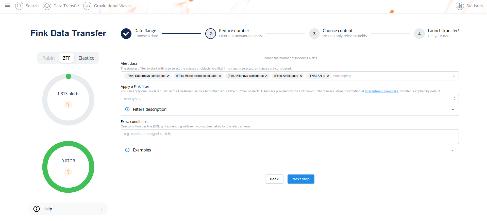
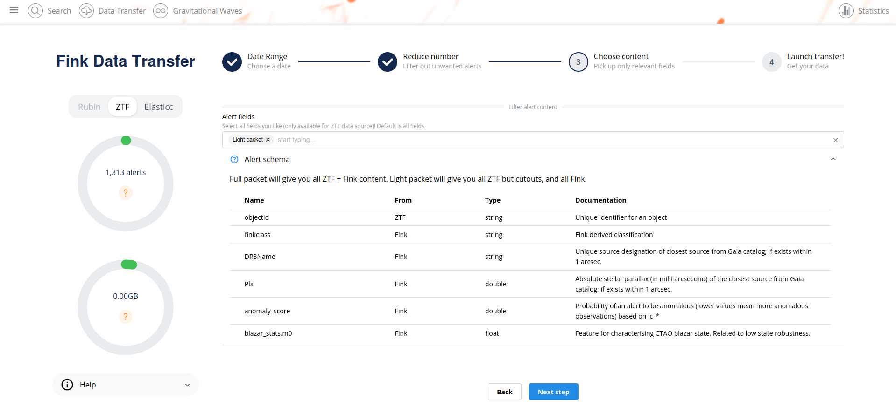
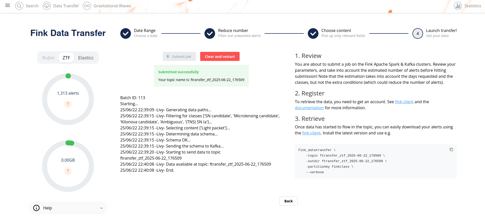

# Fink Data Transfer

_date 22/06/2025_

This manual has been tested for `fink-client` version 9.0. In case of trouble, send us an email (contact@fink-broker.org) or [open an issue](https://github.com/astrolabsoftware/fink-client/issues).

## Purpose

The Data Transfer service allows users to explore and transfer historical data at scale: [https://fink-portal.org/download](https://fink-portal.org/download). This service lets users to select any observing nights for various surveys (ZTF, Elasticc simulations, and forthcoming LSST), define the content of the output, and stream data directly to anywhere!

In Fink we had so far two main services to interact with the alert data:

1. Fink Livestream: based on Apache Kafka, to receive alerts in real-time based on user-defined filters.
2. Fink Science Portal: web application (and REST API) to access and display all processed data.

The first service enables data transfer at scale, but you cannot request alerts from the past. The second service lets you query data from the beginning of the project (2019!), but the volume of data to transfer for each query is limited. **Hence, we were missing a service that would enable massive data transfer for historical data.**

This third service is mainly made for users who want to access a lot of alerts for:

1. building data sets,
2. training machine/deep learning models,
3. performing massive or exotic analyses on processed alert data provided by Fink.

We decided to _stream_ the output of each job. In practice, this means that the output alerts will be send to the Fink Apache Kafka cluster, and a stream containing the alerts will be produced. You will then act as a consumer of this stream, and you will be able to poll alerts knowing the topic name. This has many advantages compared to traditional techniques:

1. Data is available as soon as there is one alert pushed in the topic.
2. The user can start and stop polling whenever, resuming the poll later (alerts are in a queue).
3. The user can poll the stream many times, hence easily saving data in multiple machines.
4. The user can share the topic name with anyone, hence easily sharing data.
5. The user can decide to not poll all alerts.


## Installation of fink-client

To ease the consuming step, the users are recommended to use the [fink-client](https://github.com/astrolabsoftware/fink-client), which is a wrapper around Apache Kafka. `fink_client` requires a version of Python 3.9+.

### Install with pip

From a terminal, you can install fink-client simply using `pip`:

```bash
pip install fink-client --upgrade
```

### Use or develop in a controlled environment

For development, we recommend the use of a virtual environment:

```bash
git clone https://github.com/astrolabsoftware/fink-client.git
cd fink-client
python -m venv .fc_env
source .fc_env/bin/activate
pip install -r requirements.txt
pip install .
```

## Registering

In order to connect and poll alerts from Fink, you first need to get your credentials. Subscribe by filling this [form](https://forms.gle/2td4jysT4e9pkf889) (same than for the livestream service -- so you do not need to it twice). After filling the form, we will send your credentials. Register them on your laptop by simply running on a terminal:

```bash
# access help using `fink_client_register -h`
fink_client_register \
	-username <USERNAME> \ # given privately
	-group_id <GROUP_ID> \ # given privately
	-mytopics <topic1 topic2 etc> \ # see https://fink-broker.readthedocs.io/en/latest/science/filters/
	-servers kafka-ztf.fink-broker.org:24499 \
	-maxtimeout 10 \ # in seconds
	 --verbose
```

where `<USERNAME>` and `<GROUP_ID>` have been sent to you privately. By default, the credentials are installed in the home:

```bash
cat ~/.finkclient/credentials.yml
```

## Defining your query

To start the service, connect to [https://fink-portal.org/download](https://fink-portal.org/download). The construction of the query is a guided process.
First choose the data source: ZTF or ELASTICC synthetic lightcurves. Then choose the dates for which you would like to get alert data using the calendar. You can choose multiple consecutive dates.



For ZTF or Rubin, you can further filter the data in three ways:

1. You can choose the class(es) of interest. By default, you will receive all alerts between the chosen dates, regardless of their classification in Fink. By using the dropdown button, you can also select one or more classes to be streamed.
2. You can choose to add a filter use in real-time during the night. This is useful if you want to replay an analysis on a previous night.
3. Optionally, you can also impose extra conditions on the alerts you want to retrieve based on their content. You will simply specify the name of the parameter with the condition (SQL syntax). If you have several conditions, put one condition per line, ending with semi-colon. Example of valid conditions:

```sql
-- Example 1
-- Alerts with magnitude above 19.5 and
-- at least 2'' distance away to nearest
-- source in ZTF reference images:
candidate.magpsf > 19.5;
candidate.distnr > 2;

-- Example 2: Using a combination of fields
(candidate.magnr - candidate.magpsf) < -4 * (LOG10(candidate.distnr) + 0.2);

-- Example 3: Filtering on ML scores
rf_snia_vs_nonia > 0.5;
snn_snia_vs_nonia > 0.5;
```

See [here](https://zwickytransientfacility.github.io/ztf-avro-alert/) for the available ZTF fields. Note that ZTF fields most users want will typically start with `candidate.`. Fink added value fields can be found at [https://fink-broker.readthedocs.io/en/latest/broker/science_modules/](https://fink-broker.readthedocs.io/en/latest/broker/science_modules/).

Finally you can choose the content of the alerts to be returned. You have three types of content:
1. Light packet: lightweight (~1.4 KB/alerts), this option transfers only necessary fields for working with lightcurves plus all Fink added values. Prefer this option to start.
2. Full packet: original ZTF alerts plus all Fink added values.
3. Any fields you want: instead of the pre-defined schema from above, you can also choose to download only the fields of interest for you. Prefer this option if you know what you want (and this will reduce greatly the volume of data to transfer).

Alert schema can be accessed directly in the webpage by opening the accordion below the dropdown menu:



Note that you can apply filters (e.g. class, extra conditions, etc.) on any alert fields regardless of the final alert content as the filtering is done prior to the output schema. Once you have filled all parameters, go to the last iteration, and review all parameters before hitting the submission button:



This estimation takes into account the number of alerts per night, the number of alerts per classes and the additional livestream filter, but it does not account for the extra conditions (that could further reduce the number of alerts). You will also provide an estimation of the size of the data to be transfered. You can update your parameters if need be, the estimations will be updated in real-time. After submission, your job will be triggered on the Fink Apache Spark cluster, and a topic name will be generated. Keep this topic name with you, you will need it to get the data. Details about the progress will be automatically displayed on the page.

## Consuming the alert data

### Standard

On the submission web page, when you read the message:

```bash
25/06/22 22:39:20 -Livy- Starting to send data to topic ftransfer_ztf_2025-06-22_176509
```

this means you can already start polling the data on your computer. You will then invoke for example (see the command on the right panel):

```bash
fink_datatransfer \
    -topic <topic name> \
    -outdir <output directory> \
    -partitionby finkclass \
    --verbose
```

Alert data will be consumed and stored on disk. In this example data will be partitioned by alert class, this means the alerts will be stored by their classification label and you will have e.g.

```bash
tree -d outdir/
outdir/
├── **
│   ├── part-0-13000.parquet
│   ├── part-0-16000.parquet
│   ├── part-0-18000.parquet
│   ├── part-0-3000.parquet
│   ├── part-0-4000.parquet
│   ├── part-0-6000.parquet
│   └── part-0-8000.parquet
├── Ae*
├── AGB*
├── AGB*_Candidate
├── AGN
├── AGN_Candidate
├── Ambiguous
├── BClG
├── Be*
├── Blazar
├── Blazar_Candidate
├── BLLac
├── Blue
├── BlueSG*
├── BlueStraggler
├── BYDra
├── C*
├── CataclyV*
...
```

You can then easily read the alert data in a Pandas DataFrame for example:

```python
import pandas as pd

pdf = pd.read_parquet('outdir')

pdf.head(2)
       objectId               candid     magpsf  sigmapsf  fid  ...
0  ZTF18abyjrnl  2182290200315010047  18.590357  0.073010    2  ...
1  ZTF18acpdmhl  2182336375415015008  19.446053  0.166661    1  ...
```

You can stop the poll by hitting `CTRL+C` on your keyboard, and resume later. The poll will restart from the last offset, namely you will not have duplicate. In case you want to start polling data from the beginning of the stream, you can use the `--restart_from_beginning` option:

```bash
# Make sure <output directory> is empty or does not
# exist to avoid duplicates.
fink_datatransfer \
    -topic <topic name> \
    -outdir <output directory> \
    -partitionby finkclass \
    --verbose \
    --restart_from_beginning
```

Finally you can inspect the schema of the alerts using the option `--dump_schema`:


```bash
# Make sure <output directory> is empty or does not
# exist to avoid duplicates.
fink_datatransfer \
    -topic <topic name> \
    -outdir <output directory> \
    -partitionby finkclass \
    --verbose \
    --dump_schema
```

The option will produce a json file on disk whose name is `schema_<topic name>.json`. Schema can be inspected using e.g.:

```bash
cat filename.json | jq
```

### Multiprocessing

From `fink-client` version 7.0, we have introduced the functionality of simultaneous downloading from multiple partitions through the implementation of multi-processing technology, which is an approach that takes advantage of modern hardware resources to run multiple tasks in parallel.
By using this strategy, the service is able to simultaneously access different partitions of the data stored in the Kafka server, enabling faster and more efficient transfer. The benefits of this approach are numerous, ranging from optimizing transfer times to making more efficient use of available hardware resources.

By default, the client will use all available logical CPUs. You can also specify the number of CPUs to use, as well as the batch size from the command line:

```bash
fink_datatransfer \
    -topic <topic name> \
    -outdir <output directory> \
    -partitionby finkclass \
    -nconsumers 5 \
    -batchsize 1000 \
    --verbose
```

More details on the expected performances are given in this [post](https://fink-broker.org/news/2023-01-17-data-transfer/).

## How is this done in practice?


_(1) the user connects to the service and request a transfer by filling fields and hitting the submit button. (2) Dash callbacks build and upload the execution script to HDFS, and submit a job in the Fink [Apache Spark](https://spark.apache.org/) cluster using the [Livy](https://livy.apache.org/) service. (3) Necessary data is loaded from the distributed storage system containing Fink data and processed by the Spark cluster. (4) The resulting alerts are published to the Fink [Apache Kafka](https://kafka.apache.org/) cluster, and they are available up to 7 days by the user. (5) The user can retrieve the data using e.g. the Fink client, or any Kafka-based tool._

## Troubleshooting

In case of trouble, send us an email (contact@fink-broker.org) or [open an issue](https://github.com/astrolabsoftware/fink-client).

### Timeout error

If you get frequent timeouts while you know there are alerts to poll (especially if you are polling from outside of Europe where the servers are), try to increase the timeout (in seconds) in your configuration file:

```bash
# edit ~/.finkclient/credentials.yml
maxtimeout: 30
```

### Known fink-client bugs

1. With version 4.0, you wouldn't have the partitioning column when reading in a dataframe. This has been corrected in 4.1.
2. With version 7.0, files were overwritten because they were sharing the same names, hence leading to fewer alerts than expected. This has been corrected in 7.1.
3. With version prior to 9, you could not partition by time.

## Final note

You might experience some service interruptions, or inefficiencies. This service is highly demanding in resources for large jobs (there is TBs of data behind the scene!), so we keep monitoring the load of the clusters and optimizing the current design.