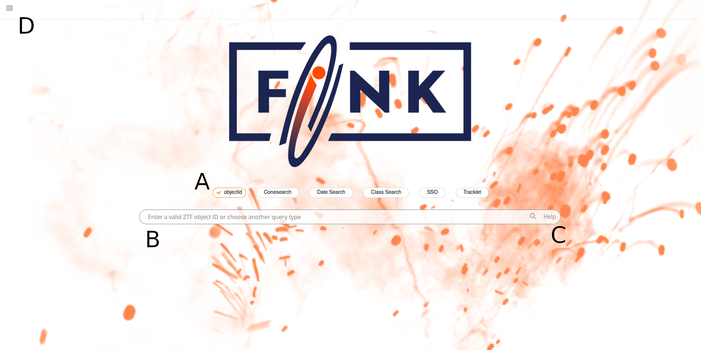
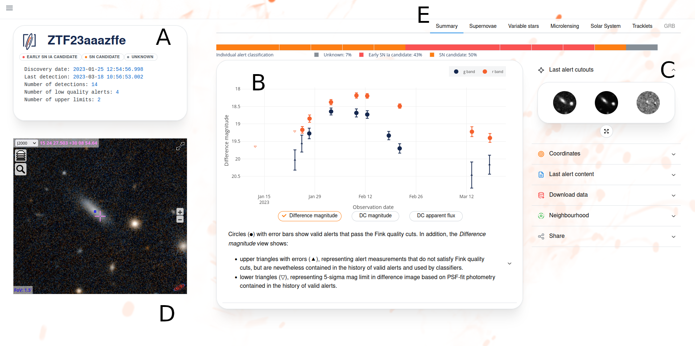

# Science Portal & REST API

_date 21/03/2023_

In case of trouble, send us an email (contact@fink-broker.org) or [open an issue](https://github.com/astrolabsoftware/fink-science-portal/issues).

## Purpose

The Science Portal is a web application ([https://fink-portal.org](https://fink-portal.org)) to query and visualise Fink processed data. You can run simple queries and quickly display results. After each night, the alert data are aggregated and pushed to HBase tables. This means that you will not only access alert data, but _object_ data, that is all the alerts emitted from day zero for a given object on the sky will be available directly (while in individual alert packet only 30 days of data in the past is available).

## How to use it?

_A: Select the type of queries to execute. B: enter the query to run. C: get help on how to formulate your query. D: menu containing several links to other parts of the portal, including a link to the API and the statistics page._

_A: Summary properties for the object. B: Complete light-curve of the object. The users can change units to display difference magnitude, DC magnitude, or DC apparent flux as a function of time. Filter bands are shown in different colours. C: Additional information such as the cutouts from the last alert packet of this object (click on the button to enlarge), alert packet data, closest sources from external catalogues, or how to download and share data. D: Interactive Aladin view of the object with the PanSTARRS-DR1 image centred at the position of the latest alert. E: Tabs to trigger different views of the object. The views focus on specific aspect of the data (such as the evolution of classification module scores for Supernovae detection) and the users can perform data fit based on pre-loaded models (e.g. variable stars, microlensing). New features and new views are regularly added based on our community feedback. As of March 2023, the Science Portal gives access to more than 110 million ZTF alerts processed by Fink._

You can also find information about the statistics on this [page](https://fink-broker.org/2021-12-01-statistics/).

## REST API

The Science Portal uses the Fink REST API under the hood to communicate with the database. You can also use this API to access data programatically. There are several endpoints:

| HTTP Method | URI | Action | Availability |
|-------------|-----|--------|--------------|
| POST/GET | https://fink-portal.org/api/v1/objects| Retrieve single object data from the Fink database | &#x2611;&#xFE0F; |
| POST/GET | https://fink-portal.org/api/v1/explorer | Query the Fink alert database | &#x2611;&#xFE0F; |
| POST/GET | https://fink-portal.org/api/v1/latests | Get latest alerts by class | &#x2611;&#xFE0F; |
| POST/GET | https://fink-portal.org/api/v1/sso | Get confirmed Solar System Object data | &#x2611;&#xFE0F; |
| POST/GET | https://fink-portal.org/api/v1/ssocand | Get candidate Solar System Object data | &#x2611;&#xFE0F; |
| POST/GET | https://fink-portal.org/api/v1/tracklet | Get tracklet data | &#x2611;&#xFE0F; |
| POST/GET | https://fink-portal.org/api/v1/cutouts | Retrieve cutout data from the Fink database| &#x2611;&#xFE0F; |
| POST/GET | https://fink-portal.org/api/v1/xmatch | Cross-match user-defined catalog with Fink alert data| &#x2611;&#xFE0F; |
| POST/GET | https://fink-portal.org/api/v1/bayestar | Cross-match LIGO/Virgo sky map with Fink alert data| &#x2611;&#xFE0F; |
| POST/GET | https://fink-portal.org/api/v1/statistics | Statistics concerning Fink alert data| &#x2611;&#xFE0F; |
| POST/GET | https://fink-portal.org/api/v1/random | Draw random objects from the Fink database| &#x2611;&#xFE0F; |
| GET  | https://fink-portal.org/api/v1/classes  | Display all Fink derived classification | &#x2611;&#xFE0F; |
| GET  | https://fink-portal.org/api/v1/columns  | Display all available alert fields and their type | &#x2611;&#xFE0F; |

You will find more information on how to use the API at [https://fink-portal.org/api](https://fink-portal.org/api), and there are many tutorials at [https://github.com/astrolabsoftware/fink-tutorials](https://github.com/astrolabsoftware/fink-tutorials).

## Limitations

Although the Science Portal and the REST API gives you access to hundreds millions of alerts, it is not designed to run complex queries, or massively download data. Instead you would use the Data Transfer service.

You might notice slowness sometimes, even transient downtimes, especially around 8pm UTC. This is when we perform database operations (heavy writes!). We are working on it!