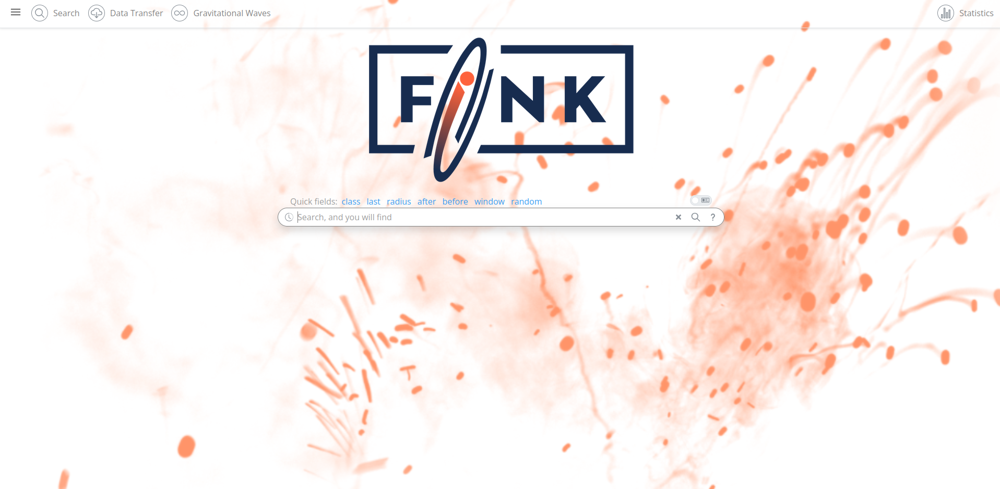
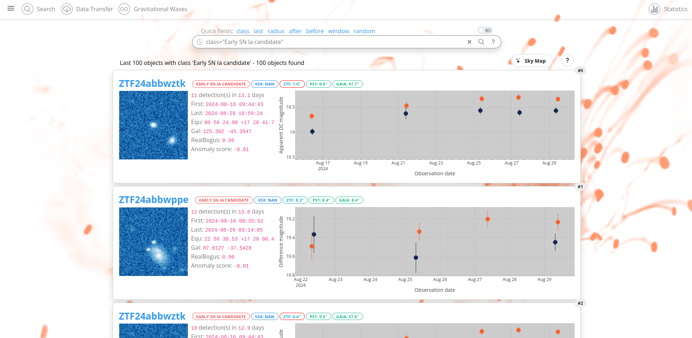
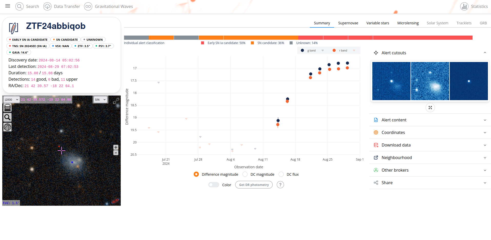
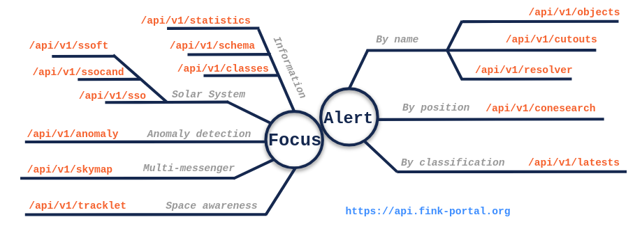

The Science Portal is a web application ([https://fink-portal.org](https://fink-portal.org)) designed for querying and visualizing Fink-processed data. You can run simple queries and quickly display the results. After each night, the alert data is aggregated and pushed to HBase tables. This means you will not only have access to alert data, but also to object data; all alerts emitted from day zero for a given object in the sky will be available directly (whereas individual alert packets only contain 30 days of past data). Under the hood, it utilizes a publicly exposed REST API ([https://api.fink-portal.org](https://api.fink-portal.org)) that you can use to programmatically access the data.

## Quick start Portal

Open your favourite web browser, and go to [https://fink-portal.org](https://fink-portal.org). You will arrive on a page with a navigation bar on top, and a search bar in the middle:



You can enter many things in the search bar: name of particular astronomical object, ZTF object ID, celestial coordinates, class name, name of an asteroid or a comet, ... If you are unsure how to formulate your request, use the `?` button on the right of the search bar. This search bar is sort of smart, in the sense that as you write it tries to guess what you are doing (kudos to [@karpov-sv](https://github.com/karpov-sv) for the implementation!).

Once your query has been run, the results are displayed:



By default a summary of the latest 100 results are displayed (you can change this number in the query by adding the parameter `last=` at the end of the query). Note that if you prefer a plain table, just trigger the radio button on the top right of the search bar, and fire again your query. The results can also be displayed on a skymap by clicking on the button `Sky Map`. A help button is also available at the top right of the result list.

Once you found an interesting object, just click on its name to open its page to access more information:



In case you notice something is not working, or you would like to add more features to the portal, just open an issue at [https://github.com/astrolabsoftware/fink-science-portal](https://github.com/astrolabsoftware/fink-science-portal).

## Quick start API



The Science Portal utilizes the Fink REST API to communicate with the database. You can also use this API to access data programmatically, regardless of the programming language you choose. In practice, we will provide examples in Python, as it is the most widely used language among the Fink community of users. The structure of a request is always the same:

```python
# in Python 3.x
import requests

r = requests.post(ENDPOINT, json=ARGS)
```

`ENDPOINT` is a specific URL (Uniform Resource Locator) where you can access data. Each endpoint corresponds to a particular function or resource in the API, allowing you to perform different types of queries. For example

- `ENDPOINT = https://api.fink-portal.org/api/v1/objects` gives you access to objects based on their name
- `ENDPOINT = https://api.fink-portal.org/api/v1/latests` gives you access to objects based on their classification.

`ARGS` is a dictionary with the different arguments to your query. Each endpoint will have its own set of arguments that you can easily access by just navigating to the endpoint definition at [https://api.fink-portal.org](https://api.fink-portal.org). For example, let's access the data for the object ID `ZTF21aaxtctv`:

```python
import requests

# get data for ZTF21aaxtctv
r = requests.post(
  "https://api.fink-portal.org/api/v1/objects",
  json={
    "objectId": "ZTF21aaxtctv",
    "output-format": "json"
  }
)
```

We use the endpoint `https://api.fink-portal.org/api/v1/objects` with two parameters: the name of the desired object, and the format of the output. The result is encapsulated inside `r`. You can access it using various methods such as `r.json()` and `r.content`, but for convenience you can also use Pandas to nicely format the output:

```python
import io
import pandas as pd

pdf = pd.read_json(io.BytesIO(r.content))
```

And you get a DataFrame (table) whose each row is an alert emitted when the object varies, and the columns are the available fields (see the [schema page](../../developers/schemas.md)). More options for this endpoint are discussed at [Search by name](objectid.md).

!!! info "API documentation"
    We expose at [https://api.fink-portal.org](https://api.fink-portal.org) a user interface to visualize and interact with the API's resources. It is automatically generated from our OpenAPI Specification, with the visual documentation making it easy for back end implementation and client side consumption. Try it out!

Do not hesitate to explore all ways to query the data using the left bar of this documentation website! You will find other working examples on how to use the API using its [test suite](https://github.com/astrolabsoftware/fink-science-portal/tree/master/tests), and there are many tutorials at [https://github.com/astrolabsoftware/fink-tutorials](https://github.com/astrolabsoftware/fink-tutorials).

## Limitations

!!! warning "Choose carefuly your tools!"

    Although the Science Portal and the REST API gives you access to hundreds millions of alerts, they are not designed to massively download data. Instead you would use the [Data Transfer service](../data_transfer.md).

    Similarly they are not designed to run complex queries on the data. Instead you would design a [filter](../../broker/filters.md) and then access your data using the [Livestream service](../livestream.md).
