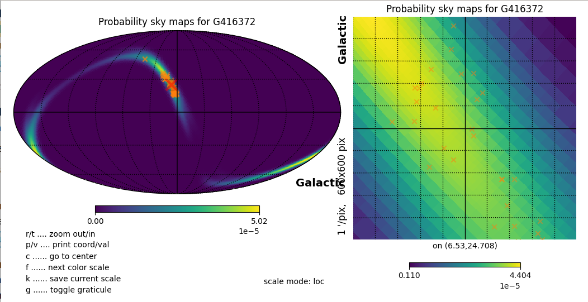
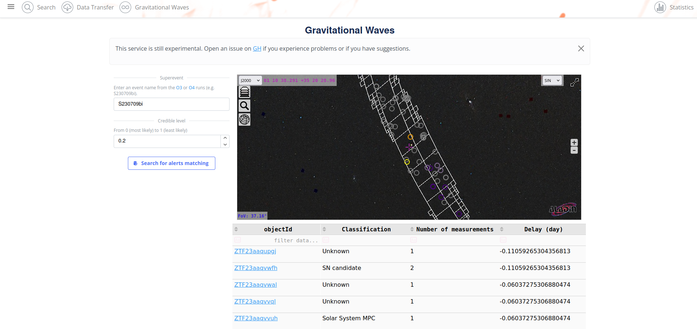

## Cross-match with LIGO/Virgo sky maps

### API

!!! info "List of arguments"
    The list of arguments for retrieving object data can be found at [https://api.fink-portal.org](https://api.fink-portal.org)

Let's assume you want get all alerts falling inside a given LIGO/Virgo/Kagra credible region sky map. Just use the event name:

```python
import io
import requests
import pandas as pd

# GW credible region threshold to look for. Note that the values in the resulting
# credible level map vary inversely with probability density: the most probable pixel is
# assigned to the credible level 0.0, and the least likely pixel is assigned the credible level 1.0.
# Area of the 20% Credible Region:
credible_level = 0.2

# Query Fink
r = requests.post(
    "https://api.fink-portal.org/api/v1/skymap",
    json={
        "event_name": "S230709bi",
        "credible_level": credible_level,
        "output-format": "json"
    }
)

pdf = pd.read_json(io.BytesIO(r.content))
```

Fink returns all alerts emitted within `[-1 day, +6 day]` from the GW event inside the chosen credible region.

!!! warning "Performance"
    The bayestar service functions as a wrapper for the conesearch service, so its performance is not superior. It is recommended for use with a small to moderate number of entries (fewer than 100). However, we do utilize caching behind the scenes. This means that if you encounter a `Timeout` error, you can rerun the query, and subsequent attempts may yield results more quickly (x10). We are actively working on developing an improved large-scale crossmatch service.

Alternatively, you can input a sky map retrieved from the GraceDB event page, or distributed via GCN. Concretely on [S230709bi](https://gracedb.ligo.org/superevents/S230709bi/view/):

```python
import io
import requests
import pandas as pd

# LIGO/Virgo probability sky maps, as gzipped FITS (bayestar.fits.gz)
data = requests.get("https://gracedb.ligo.org/api/superevents/S230709bi/files/bayestar.fits.gz")

# Query Fink
r = requests.post(
    "https://api.fink-portal.org/api/v1/skymap",
    json={
        "bayestar": str(data.content),
        "credible_level": 0.2,
        "output-format": "json"
    }
)

pdf = pd.read_json(io.BytesIO(r.content))
```

You will get a Pandas DataFrame as usual, with all alerts inside the region (within `[-1 day, +6 day]`). Here is an example of using Fink classes to quickly filter out unwanted candidates:

```python
pdf.groupby("d:classification").size() # (1)!
```

1. Output:
```
d:classification
SN candidate               2
Solar System MPC           2
Solar System candidate    42
Unknown                   35
```

You can safely ignore `Solar System MPC`, but `Solar System candidate` can also be genuine new extra-galactic transients that we misclassified. Finally, you can overplot alerts on the sky map:

```python
import io
import requests
import pandas as pd

import gzip
from urllib.request import URLError, urlopen

import healpy as hp
import matplotlib.pyplot as plt
from astropy.io import fits

# LIGO/Virgo probability sky maps, as gzipped FITS (bayestar.fits.gz)
skymap = urlopen("https://gracedb.ligo.org/api/superevents/S230709bi/files/bayestar.fits.gz").read()

# Query Fink
r = requests.post(
    "https://api.fink-portal.org/api/v1/skymap",
    json={
        "bayestar": str(skymap),
        "credible_level": 0.2,
        "output-format": "json"
    }
)

pdf = pd.read_json(io.BytesIO(r.content))

with gzip.open(io.BytesIO(skymap), "rb") as f:
    with fits.open(io.BytesIO(f.read()), ignore_missing_simple=True) as hdul:
        hpx, header_ = hp.read_map(hdul[1], h=True, field=0)

header = {i[0]: i[1] for i in header_}

title = "Probability sky maps for {}".format(header["OBJECT"])
hp.mollzoom(hpx, coord="G", title=title)

if len(pdf) > 0:
    hp.projscatter(
        pdf["i:ra"],
        pdf["i:dec"],
        lonlat=True,
        marker="x",
        color="C1",
        alpha=0.5
    )

hp.graticule()
plt.show()
```



You can also find this tutorial in the [fink-tutorials repository](https://github.com/astrolabsoftware/fink-tutorials/blob/main/MMA/gravitational_waves.ipynb).
Note that you can also use any map with the same structure than LVK skymaps:

```python
import io
import requests
import pandas as pd

fn = "my.fits.gz"

# Query Fink
data = open(fn, "rb").read()
r = requests.post(
    "https://api.fink-portal.org/api/v1/skymap",
    json={
        "bayestar": str(data),
        "credible_level": credible_level,
        "output-format": "json"
    }
)

pdf = pd.read_json(io.BytesIO(r.content))
```

### Science Portal

On the portal, go to [https://fink-portal.org/gw](https://fink-portal.org/gw), enter an event name from the O3 or O4 runs (e.g. S230709bi), choose the credible level, and hit the button `Search`:




The crossmatch is not super fast, but results are cached. Hence if you hit a timeout, relaunched the query, and you should get results the next time.
