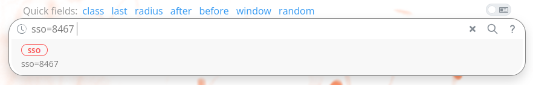
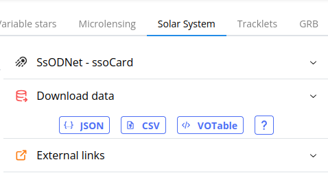
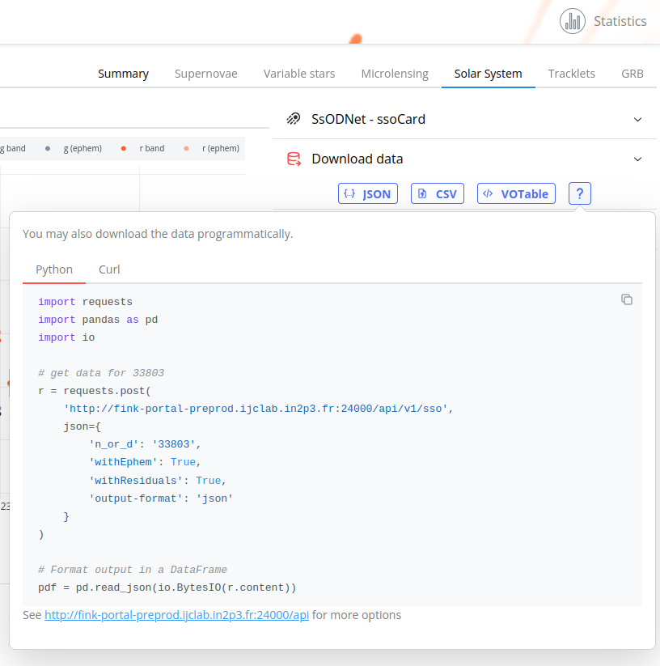

## Known Solar System objects

### API


#### Basic

!!! info "List of arguments"
    The list of arguments for retrieving known SSO data can be found at [https://fink-portal.org/api/v1/sso](https://fink-portal.org/api/v1/sso)

You can enter any name (e.g. Lucretia, JulienPeloton), number (e.g. 8467, 18582, 302530), or designation (e.g. 2010 JO69, 2017 AD19) of asteroids. Under the hood, we resolve the name using the [quaero](https://ssp.imcce.fr/webservices/ssodnet/api/quaero/) service from SsODNet. You can also search for comets (e.g. 10P or C/2020 V2), but note that we have far less comets than asteroids.

In a unix shell, you would simply use

```bash
# Get data for the asteroid 8467 and save it in a CSV file
curl -H "Content-Type: application/json" -X POST -d '{"n_or_d":"8467", "output-format":"csv"}' https://fink-portal.org/api/v1/sso -o 8467.csv

# you can also specify parameters in the URL, e.g. with wget:
wget "https://fink-portal.org/api/v1/sso?n_or_d=8467&output-format=json" -O 8467.json
```

In python, you would use

```python
import io
import requests
import pandas as pd

# get data for object 8467
r = requests.post(
  "https://fink-portal.org/api/v1/sso",
  json={
    "n_or_d": "8467",
    "output-format": "json"
  }
)

# Format output in a DataFrame
pdf = pd.read_json(io.BytesIO(r.content))
```

You can also get a votable using the json output format:

```python
from astropy.table import Table

# get data for asteroid 8467 in JSON format...
r = ...

t = Table(r.json())
```

#### Adding ephemerides from Miriade

You can also attach the ephemerides provided by the [Miriade ephemeride service](https://ssp.imcce.fr/webservices/miriade/api/ephemcc/):

```python
import requests
import pandas as pd

# get data for object 8467
r = requests.post(
  "https://fink-portal.org/api/v1/sso",
  json={
    "n_or_d": "8467",
    "withEphem": True,
    "output-format": "json"
  }
)

# Format output in a DataFrame
pdf = pd.read_json(io.BytesIO(r.content)) # (1)!
```

1. Output fields:
```
Index(['index', 'Date', 'LAST', 'HA', 'Az', 'H', 'Dobs', 'Dhelio', 'VMag',
       'SDSS:g', 'SDSS:r', 'Phase', 'Elong.', 'AM', 'dRAcosDEC', 'dDEC', 'RV',
       'RA', 'Dec', 'Longitude', 'Latitude', 'd:cdsxmatch', 'd:mulens',
       'd:rf_kn_vs_nonkn', 'd:rf_snia_vs_nonia', 'd:roid', 'd:snn_sn_vs_all',
       'd:snn_snia_vs_nonia', 'i:candid', 'i:chipsf', 'i:classtar', 'i:dec',
       'i:diffmaglim', 'i:distnr', 'i:distpsnr1', 'i:drb', 'i:fid', 'i:field',
       'i:isdiffpos', 'i:jd', 'i:jdendhist', 'i:jdstarthist', 'i:maggaia',
       'i:magnr', 'i:magpsf', 'i:magzpsci', 'i:ndethist', 'i:neargaia',
       'i:nid', 'i:nmtchps', 'i:objectId', 'i:publisher', 'i:ra', 'i:rb',
       'i:rcid', 'i:sgscore1', 'i:sigmagnr', 'i:sigmapsf', 'i:ssdistnr',
       'i:ssmagnr', 'i:ssnamenr', 'i:tooflag', 'i:xpos', 'i:ypos',
       'd:tracklet', 'v:classification', 'v:lastdate', 'v:constellation',
       'i:magpsf_red'],
      dtype='object')
```

Where first columns are fields returned from Miriade (beware it adds few seconds delay).

!!! warning "Limitations"
    There are some limitations:

    - Color ephemerides are returned only for asteroids
    - Temporary designations (C/... or YYYY...) do not have ephemerides available

#### Querying several objects at once

You can also query several objects at the same time:

```python
import io
import requests
import pandas as pd

# get data for object 8467 and 1922
r = requests.post(
  "https://fink-portal.org/api/v1/sso",
  json={
    "n_or_d": "8467,1922",
    "output-format": "json"
  }
)

# Format output in a DataFrame
pdf = pd.read_json(io.BytesIO(r.content))
```

!!! warning "Mixing types"
    Note that you can mix asteroid and comet names, unless you specify `withEphem=True`, in which
    case you must give only a list of asteroid names or list of comet names (schemas for ephemerides are not the same).

!!! tip "Optimisation: selecting only a subset of fields"
    By default, we transfer all available data fields (original ZTF fields and Fink science module outputs). But you can also choose to transfer only a subset of the fields:

    ```python
    # select only jd, and magpsf
    r = requests.post(
        "https://fink-portal.org/api/v1/sso",
        json={
            "n_or_d": "8467",
            "columns": "i:jd,i:magpsf"
        }
    )
    ```

    Note that the fields should be comma-separated. Unknown field names are ignored.

#### Getting image stamps

You can query stamps for all alerts using the argument `withcutouts`:

```python
import requests

# get data for object 8467
r = requests.post(
  "https://fink-portal.org/api/v1/sso",
  json={
    "n_or_d": "8467",
    "withcutouts": True,
    "output-format": "json"
  }
)

# print one cutout
array = r.json()[0]["b:cutoutScience_stampData"] # (1)!
```

1. Output:
```
[[123.70613861, 125.00068665, 129.01676941, ..., 123.77194214,
  130.44299316, 106.22817993],
 [121.61331177, 128.18247986, 124.99162292, ..., 115.30529785,
  129.93824768, 100.24826813],
 [124.31635284, 134.16503906, 125.13191223, ..., 131.05186462,
  116.30375671, 102.97401428],
 ...,
 [133.20661926, 123.14172363, 121.78632355, ..., 132.95498657,
  131.95939636, 111.22276306],
 [129.26271057, 127.34268188, 123.1470108 , ..., 126.02961731,
  128.23413086, 107.28420258],
 [126.06323242, 122.42414093, 121.47638702, ..., 129.28106689,
  131.03790283, 109.95378876]]
```


Note that by default, the `Science` cutouts are downloaded (see also [Image data](imagesearch.md)). You can also ask for the `Template` or the `Difference` stamps:

```python
# get data for object 8467
r = requests.post(
  "https://fink-portal.org/api/v1/sso",
  json={
    "n_or_d": "8467",
    "withcutouts": True,
    "cutout-kind": "Template",
    "output-format": "json"
  }
)
```

!!! warning "Performances"
    Downloading cutouts for SSO is time-consuming, and heavy for the server because (a) data is indexed against `objectId` and not `ssnamenr` and (b) decoding each binary gzipped FITS file has a cost. On average, it takes 0.5 second per alert.

For more information about the ZTF stamps, see [https://irsa.ipac.caltech.edu/data/ZTF/docs/ztf_explanatory_supplement.pdf](https://irsa.ipac.caltech.edu/data/ZTF/docs/ztf_explanatory_supplement.pdf)

#### Getting lightcurve residuals

We have several phase curve models implemented in Fink (see the SSOFT section below). You can retrieve the residuals (`obs - model`) using the sHG1G2 model (Carry et al. 2024):

```python
import requests
import pandas as pd

# get data for object 8467
r = requests.post(
  "https://fink-portal.org/api/v1/sso",
  json={
    "n_or_d": "8467",
    "withResiduals": True,
    "output-format": "json"
  }
)

# Format output in a DataFrame
pdf = pd.read_json(io.BytesIO(r.content))
```

There will be a column named `residuals_shg1g2` with the residuals. If the parameters of the model cannot be estimated (e.g. not enough measurements, or the solver did not converge), the column will contain `NaN`.

### Science Portal

On the portal, you can easily access to SSO data by name:


or by number:


!!! warning "Partial search"

    Because we run a partial number search, the query can return data for the wrong number. E.g. if you search for `8467`, it will propose closest matches, but return data for `84673`... We are working on it, but in the meantime, if you know exactly the number, prefix your query with `sso=`. In this case it will perform an exact search

    


 selecting the `Solar System` tab on any alert associated to a known SSO objects in the MPC gives you access to its lightcurve with ephemerides:


You can inspect its astrometry, as well as phase curve modeling including the latest model including spin parameters from [Carry et al 2024](https://doi.org/10.1051/0004-6361/202449789):


Note that you can easily download data in CSV, JSON or VOTable format using the right tab:



The button `?` will give you access to snippets of code to download data programmatically:




## SSoFT: Solar System object Fink Table

!!! info "List of arguments"
    The list of arguments for retrieving alert data can be found at [https://fink-portal.org/api/v1/ssoft](https://fink-portal.org/api/v1/ssoft), and the schema of the table (json) can be found at [https://fink-portal.org/api/v1/ssoft?schema](https://fink-portal.org/api/v1/ssoft?schema)

This service lets you query the table containing aggregated parameters for known Solar System objects in Fink. This table is updated once a month, with all data in Fink.

### Basic usage

In python, you would use

```python
import io
import requests
import pandas as pd

r = requests.post(
  "https://fink-portal.org/api/v1/ssoft",
  json={
    "output-format": "parquet"
  }
)

# Format output in a DataFrame
pdf = pd.read_parquet(io.BytesIO(r.content))
```

or e.g. with curl:

```bash
curl -H "Content-Type: application/json" -X POST \
    -d '{"output-format":"parquet"}' \
    https://fink-portal.org/api/v1/ssoft -o ssoft.parquet
```

This table contains basic statistics (e.g. coverage in time for each object, name, number, ...),
fitted parameters (absolute magnitude, phase parameters, spin parameters, ...), quality statuses, and version numbers. You can retrieve the schema of the table using using the schema argument:

```python
import io
import requests
import pandas as pd

r = requests.post(
  "https://fink-portal.org/api/v1/ssoft",
  json={
    "schema": True
  }
)

schema = r.json()["args"]
```

or view it in your browser at [https://fink-portal.org/api/v1/ssoft?schema](https://fink-portal.org/api/v1/ssoft?schema).

### Single object

You can also retrieve information about a single object, using its name or IAU number:

```bash
# using name
curl -H "Content-Type: application/json" -X POST -d '{"output-format":"json", "sso_name": "Autonoma"}' https://fink-portal.org/api/v1/ssoft

# using number
curl -H "Content-Type: application/json" -X POST -d '{"output-format":"json", "sso_number": "1465"}' https://fink-portal.org/api/v1/ssoft
```

or in Python:

```python
import io
import requests
import pandas as pd

r = requests.post(
  "https://fink-portal.org/api/v1/ssoft",
  json={
    "sso_name": "Autonoma",
    "output-format": "parquet"
  }
)

# Format output in a DataFrame
pdf = pd.read_parquet(io.BytesIO(r.content))
```

!!! warning "Performance"
    Specifying the name or number does not reduce the querying time as we have to download the entire table (stored as a single file) under the hood.


### Flavors

By default, we expose the parameters from the `sHG1G2` model, that is `HG1G2`
augmented with shape and spin parameters (see [Carry et al 2024](https://doi.org/10.1051/0004-6361/202449789)). You can also choose standard `HG` or `HG1G2` models:

```python
import io
import requests
import pandas as pd

r = requests.post(
  "https://fink-portal.org/api/v1/ssoft",
  json={
    "flavor": "HG",
    "output-format": "parquet"
  }
)
```

Idem for the schema of the table: [https://fink-portal.org/api/v1/ssoft?flavor=HG&schema](https://fink-portal.org/api/v1/ssoft?flavor=HG&schema).

### Version

The table is versioned (`YYYY.MM`), and you can access previous versions (starts at `2023.07`):

```python
import io
import requests
import pandas as pd

r = requests.post(
  "https://fink-portal.org/api/v1/ssoft",
  json={
    "version": "2023.07",
    "output-format": "parquet"
  }
)
```

By default (that is `version` unspecified), the service will return the latest one.

## Candidate Solar System objects

!!! info "List of arguments"
    The list of arguments for retrieving SSO candidate data can be found at [https://fink-portal.org/api/v1/ssocand](https://fink-portal.org/api/v1/ssocand)

This service lets you query the information about candidate Solar System objects found by [fink-fat](https://github.com/FusRoman/fink-fat) (see [Enabling discoveries of Solar System objects in large alert data streams](https://www.aanda.org/articles/aa/full_html/2023/12/aa46905-23/aa46905-23.html)). In python, you would use

```python
import io
import requests
import pandas as pd

r = requests.post(
  "https://fink-portal.org/api/v1/ssocand",
  json={
    "kind": str, # (1)!
    "ssoCandId": int, # (2)!
    "start_date": str, # (3)!
    "stop_date": str, # (4)!
    "maxnumber": int, # (5)!
    "output-format": str
  }
)

# Format output in a DataFrame
pdf = pd.read_json(io.BytesIO(r.content))
```

1. Mandatory, `orbParams` or `lightcurves`
2. optional, if you know a trajectory ID. Otherwise returns all.
3. optional. Only for lightcurves. Default is 2019-11-01
4. optional. Only for lightcurves. Default is today.
5. optional. Max number of entries to retrieve. Default is 10,000.

Depending on `kind`, you would get information on:

- `lightcurves`: photometry of objects related to candidate orbits
- `orbParams`: orbital parameters for orbit candidates

## Adding more parameters from the BFT

The SSOFT of Fink contains only the parameters from the phase curve modeling.
However you can easily join this table with the [BFT]() table provided by [IMCCE]().
This table contains physical and dynamical parameters for all known objects.
Here is an example on joining the two tables:

```python
import io
import requests
import pandas as pd

# Get the SSOFT
r0 = requests.post(
  "https://fink-portal.org/api/v1/ssoft",
  json={
    "output-format": "parquet"
  }
)

ssoft = pd.read_parquet(io.BytesIO(r0.content))

# Get the BFT
r1 = requests.get("https://ssp.imcce.fr/data/ssoBFT-latest_Asteroid.parquet")
bft = pd.read_parquet(io.BytesIO(r1.content))

# Join the two
combined = ssoft.merge(bft, left_on="name", right_on="sso_name", how="left")
```

Each row of the `combined` table will contain all information from Fink and all
information from the BFT for an object! Beware though that the tables are quite 
big each, and you will need a lot of RAM to hold it in memory. In practice, choose
only the columns you need before the merge. For example:

```
cols = [
    "sso_number",
    "sso_name",
    "sso_class",
    "orbital_elements.semi_major_axis.value",
    "orbital_elements.eccentricity.value",
    "orbital_elements.inclination.value",
    "orbital_elements.node_longitude.value",
    "orbital_elements.perihelion_argument.value",
    "orbital_elements.mean_anomaly.value",
    "orbital_elements.mean_motion.value",
    "family.family_number",
    "family.family_name",
    "proper_elements.proper_semi_major_axis.value",
    "proper_elements.proper_eccentricity.value",
    "proper_elements.proper_inclination.value",
    "proper_elements.proper_sine_inclination.value",
    "tisserand_parameters.Jupiter.value",
    "albedo.value",
    "absolute_magnitude.value",
    "diameter.value",
    "taxonomy.class",
    "taxonomy.complex",
    "taxonomy.waverange",
    "taxonomy.scheme",
    "taxonomy.technique",
]
bft = pd.read_parquet(io.BytesIO(r1.content), columns=cols)

combined = ssoft.merge(bft, left_on="name", right_on="sso_name", how="left")
```
