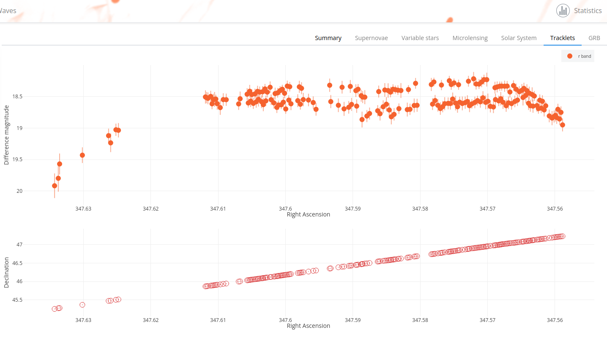

!!! info "List of arguments"
    The list of arguments for retrieving tracklet data can be found at [https://fink-portal.org/api/v1/tracklet](https://fink-portal.org/api/v1/tracklet)

!!! abstract "Pollution..."
    Thousands of active artificial objects are orbiting around Earth along with much more non-operational ones -- derelict satellites or rocket bodies, collision debris, or spacecraft payloads, significant part of them being uncatalogued. They all impact observations of the sky by ground-based telescopes by producing a large number of streaks polluting the images, as well as generating false alerts hindering the search for new astrophysical transients. While the former threat for astronomy is widely discussed nowadays in regard of rapidly growing satellite mega-constellations, the latter one -- false transients -- still lacks attention on the similar level. More information at [2202.05719](https://arxiv.org/abs/2202.05719) and [2310.17322](https://arxiv.org/abs/2310.17322).

In this service, we give access to satellite glints -- rapid flashes produced by reflections of a sunlight from flat surfaces of rotating satellites -- found on ZTF alert data. For that, we implemented a simple routine that detects, in a single exposure, a series of repeated flashes along the trajectories of otherwise invisible satellites. These objects usually leave discrete tracks (several connected dots), that we call `tracklets`. The magnitude is rather low, and can oscillate (e.g. rotating objects). This is somehow similar to solar system object, expect that these objects are mainly man-made, they are fast moving, and they typically orbit around the Earth (this
is also tighted to the detection method we use).





In order to get tracklet data, you need to specify the date in the format `YYYY-MM-DD hh:mm:ss`.
Note you can also specify bigger interval, e.g. `YYYY-MM-DD` to get all tracklets for one day,
or `YYYY-MM-DD hh` to get all tracklets for one hour.

In a unix shell, you would simply use

```bash
# Get tracklet data for the night 2021-08-10
curl -H "Content-Type: application/json" -X POST \
    -d '{"date":"2021-08-10", "output-format":"csv"}' \
    https://fink-portal.org/api/v1/tracklet -o trck_20210810.csv

# you can also specify parameters in the URL, e.g. with wget:
wget "https://fink-portal.org/api/v1/tracklet?date=2021-08-10&output-format=json" -O trck_20210810.json
```

In python, you would use

```python
import io
import requests
import pandas as pd

# Get all tracklet data for the night 2021-08-10
r = requests.post(
  "https://fink-portal.org/api/v1/tracklet",
  json={
    "date": "2021-08-10",
    "output-format": "json"
  }
)

# Format output in a DataFrame
pdf = pd.read_json(io.BytesIO(r.content))
```

You can also specify up to the second if you know the exposure time:

```python
# Get tracklet data TRCK_20211022_091949
r = requests.post(
  "https://fink-portal.org/api/v1/tracklet",
  json={
    "id": "2021-10-22 09:19:49",
    "output-format": "json"
  }
)
```

Finally if there are several tracklets in one exposure, you can select the one you want:

```python
# Get first tracklet TRCK_20211022_091949_00
r = requests.post(
  "https://fink-portal.org/api/v1/tracklet",
  json={
    "id": "2021-10-22 09:19:49 00",
    "output-format": "json"
  }
)
```

They are ordered by two digits 00, 01, 02, ...