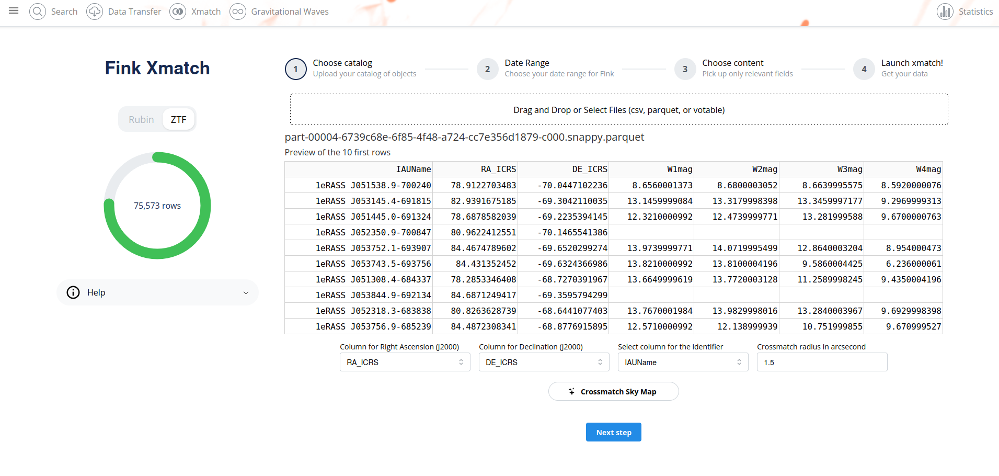
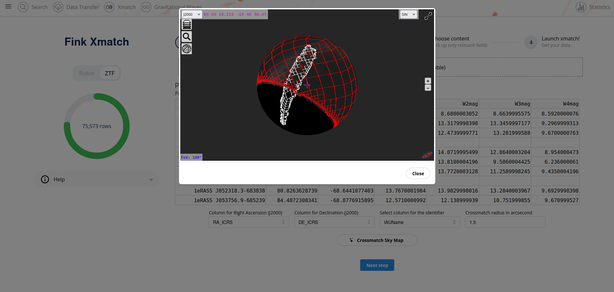
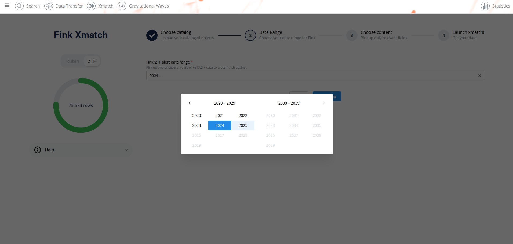
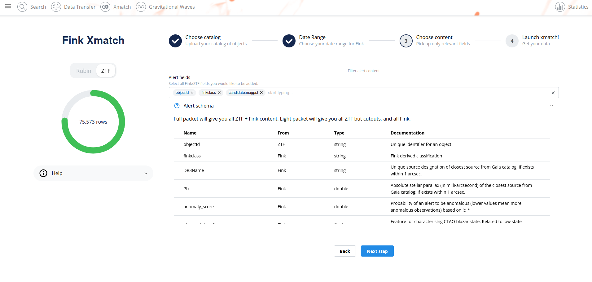
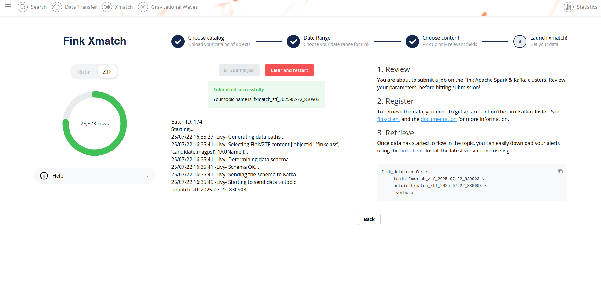

# Fink Xmatch

_date 22/07/2025_

This manual has been tested for `fink-client` version 9.1. In case of trouble, send us an email (contact@fink-broker.org) or [open an issue](https://github.com/astrolabsoftware/fink-client/issues).

## Context

For a long time, we have provided a way to retrieve alerts based on a given sky position and an angular distance, e.g.,

```python
import requests

r = requests.post(
    "https://api.fink-portal.org/api/v1/conesearch",
    json={"ra": 279.675751, "dec": 37.048361, "radius": 1.5}
)

data = r.json()
```

However, this method works efficiently for a limited number of positions. What if one has thousands of sources for which they would like to check if there are alerts nearby? And what if in addition to match IDs, one would like to have lightcurve data? As there are more than 200 million entries in the Fink alert database, this is not a trivial task!

We could have used clever techniques like those employed in the [xMatch service](http://cdsxmatch.u-strasbg.fr/xmatch/doc/) at CDS, or rely on things like HEALPix Alchemy with a relational database. However, we wanted to reuse the existing Fink data infrastructure as much as possible without additional development. In Fink, data is exposed in two places: the datalake (files) and the database (non-relational database). The database is what the Fink API example above uses. We utilize an index table based on HEALPix indices (`nside = 128`) to efficiently find matches. However, like any database, it is efficient for random access but not as effective for handling large chunks of data at once.

On the other hand, the Fink datalake contains all processed alerts in Parquet files, partitioned by time (year/month/day). This datalake is already used in the context of the Data Transfer service, as it efficiently exposes large chunks of data and enables users to express complex queries through the interface with Apache Spark, a distributed computing framework used internally in Fink. Therefore, we have decided to use the datalake again as the primary source of data.

## Installation of fink-client

To ease the consuming step, the users are recommended to use the [fink-client](https://github.com/astrolabsoftware/fink-client), which is a wrapper around Apache Kafka. `fink_client` requires a version of Python 3.9+. Documentation to install the client can be found at [services/fink_client](fink_client.md). Note that you need to be registered in order t
o poll data.

## Fink xmatch service

The Fink xmatch service is accessible from the Science Portal at https://fink-portal.org/xmatch. This is a guided process, very similar to the Data Transfer service. First, the user has the possibility to upload a catalog of sources:



The service can read catalogs in `csv`, `parquet`, or `votable` formats. Note that the total number of sources is displayed on the left ring, and the maximum number of rows is 100,000 for the initial version of the service. We also provide a preview of the first 10 rows. The user needs to specify which columns to choose for right ascension and declination in the J2000 coordinate system, as well as the (unique) identifier. The format of the coordinates can be in decimal degrees or in HMS/DMS.

You can also visualise the overlap between the catalog of sources and the ZTF sky coverage (based on DR7) by simply clicking on the `Crossmatch Sky Map` button:



The next step is to choose dates for the Fink alerts. You can choose any consecutive years between 2019 and now:



If you want only one year of Fink data, just double select the same year. Then you can choose the content to be streamed after the crossmatch:



Finally if you are happy with your setup, just submit your job on the last step! Wait a bit, the log will update automatically on the screen:



Assuming you [registered](https://github.com/astrolabsoftware/fink-client?tab=readme-ov-file#registration), you can simply retrieve the catalog of matches using the fink-client:

```bash
fink_datatransfer \
    -topic fxmatch_ztf_2025-07-22_534049 \
    -outdir fxmatch_ztf_2025-07-22_534049 \
    --verbose
```

Data will be stored as `parquet` files, and you can manipulate them using e.g. the `Pandas` library in Python:

```python
import pandas as pd

pdf = pd.read_parquet("fxmatch_ztf_2025-07-22_534049")
```

## Technical considerations

When the user submits a job, the request is sent to the Fink Apache Spark cluster at the VirtualData cloud. Each xmatch job is granted 32 cores. The user catalog of sources is uploaded to HDFS, and the xmatch is performed locally on each executor (no table join). For information, here are some expected performances for an input catalog of 75,000 rows (the size of the input catalog does not matter much):
    
| Years spanned | Input number of Fink alerts (in millions) | Execution time (in minutes) |
|---------------|-------------------------------------------|------------------------------|
| 2025          | 20                                        | 3.7                         |
| 24-25        | 58                                        | 5.7                         |
| 23-25        | 93                                        | 10.6                        |
| 22-25        | 128                                       | 15.9                        |
| 21-25        | 168                                       | 22.0                        |
| 20-25        | 199                                       | 30.7                        |

Note that this is by using brute force the datalake, without any attempt for optimisation. We expect to improve largely these performances in the future. The results of the crossmatch are then streamed to the Fink Kafka cluster for consumption. The results are available 7 days to users.

