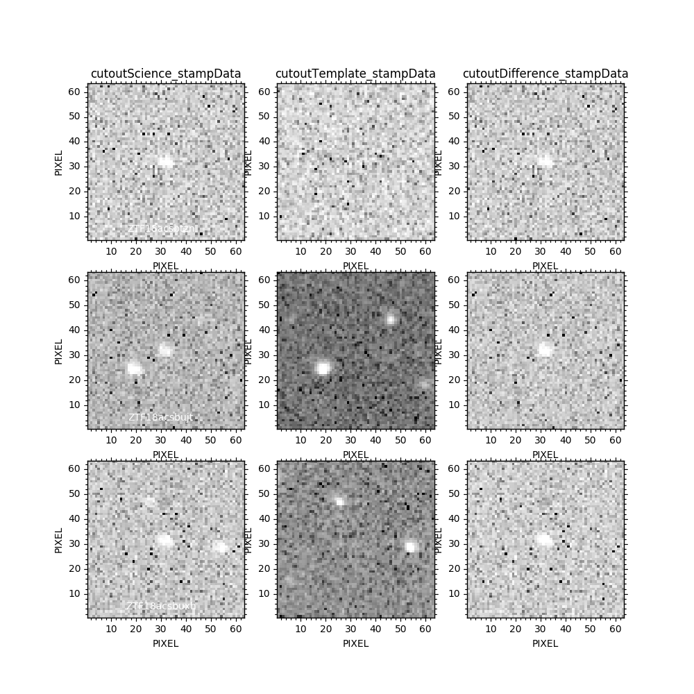

# Tutorial: Filtering bogus alerts

**Context**

This tutorial illustrates the basics of connecting to the raw database (Parquet), filtering out alerts that do not satisfy quality criteria, and pushing remaining alerts to the science database (HBase).

**Before starting**

For this tutorial, make sure:

* Fink is installed on your computer.
* Apache Spark (2.4+) is installed on your computer.
* Docker is installed on your computer.

See [Getting started](../index.md) for more information.

## Building the raw database

To build the raw database, follow the [Tutorial 1](raw_db.md). We recap the main steps here:

```bash
# Connect the alert system to the raw database
fink start stream2raw -c conf/fink.conf.tutorial2 --simulator

# Send stream of data
fink start simulator
```

where `conf/fink.conf.tutorial2` is a copy of `conf/fink.conf` updated with your configuration.

## Starting the HBase service

The scientific alerts are stored in an HBase table. You need first to get HBase installed, and start the service. See the `${FINK_HOME}/conf/install_hbase.sh` script for a local installation.

```plain
/!\ If started with bin/start-hbase.sh, the service often disconnects itself,
making the raw2science service to hang. Check if hbase is running by
executing ps aux | grep hbase.
```

The name of the HBase table can be set in the configuration file:

```bash
# in conf/fink.conf.tutorial2

# The name of the HBase table
SCIENCE_DB_NAME="test_catalog"
```

To start the service, just execute:

```bash
$HBASE_HOME/bin/start-hbase.sh
```

## Filtering data from the raw database

Once the raw database is initialised (i.e. contains at least one alert) and hbase started, you can stream data from it and apply filters and use your scientific modules. We focus here only on the first filtering part, called level one. Filters to be applied to the data can be found under `${FINK_HOME}/userfilters/levelone.py`. We provide a default filter for reference, but you can edit it or add more if wanted. The procedure for adding filters is the following:

### Create a filter in levelone.py

The skeleton of a filter is always the same:

```python
@pandas_udf(BooleanType(), PandasUDFType.SCALAR)
def my_great_filter_name(colname1: Any, colname2: Any, ...) -> pd.Series:
  """ The documentation
  """
  # Your logic based on the input columns
  column_of_booleans = ...

  return pd.Series(column_of_booleans)
```

`${FINK_HOME}/userfilters/levelone.py` contains an example of filter applying quality cuts.

### Register the filter

At the top of `${FINK_HOME}/userfilters/levelone.py`, you need to pass the name of your filter such that it gets applied to the data the next time you launch `fink start raw2science`:

```python
# Declare here the filters that will be applied in the
# level one (stream -> raw database)
filter_levelone_names = ["qualitycuts", "my_great_filter_name"]
```

Et voilà! as simple as it.

## Building the science database

To see the filters in action, execute the raw2science service:

```bash
fink start raw2science -c conf/fink.conf.tutorial2

# Send stream of data
fink start simulator
```

You can check that the table has been updated with new alerts by using the HBase shell for example:

```hbase
# hbase shell
hbase(main):001:0> list
TABLE
test_catalog
1 row(s)
Took 0.3936 seconds
=> ["test_catalog"]
hbase(main):002:0> count "test_catalog"
8 row(s)
Took 0.1316 seconds
=> 8
```

Alternatively, you can also use Apache Spark to explore the science database:

```python
# Launch pyspark shell with fink_shell
from fink_broker.sparkUtils import init_sparksession
import json

spark = init_sparksession(
    name="readingScienceDB", shuffle_partitions=2, log_level="ERROR")

# Open the catalog that describes the HBase table
with open('catalog.json') as f:
    catalog = json.load(f)

catalog_dic = json.loads(catalog)

# Create a Spark DataFrame with the science DB data in it.
df = spark.read.option("catalog", catalog)\
    .format("org.apache.spark.sql.execution.datasources.hbase")\
    .load()

print("Number of entries in {}: ".format(
  catalog_dic["table"]["name"]), df.count())
# Number of entries in test_catalog:  8

df.show()
# ...
```

Example of alerts kept after applying quality cuts:


