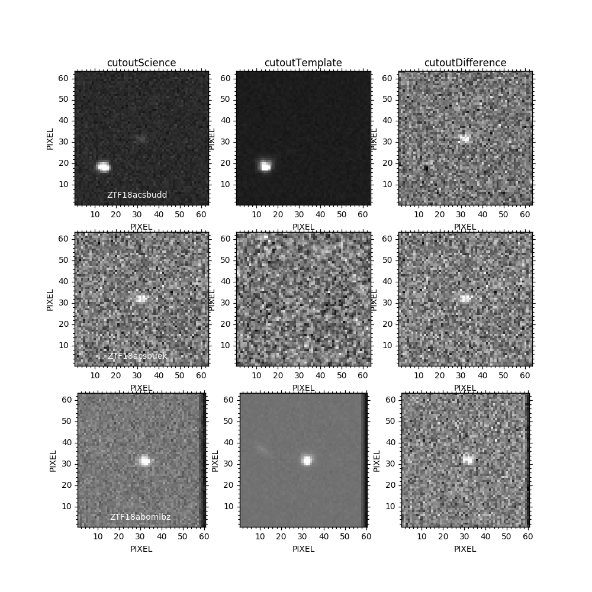

# Tutorial: Collecting alerts

**Context**

This tutorial illustrates the basics of simulating a data stream, reading it using Fink and archiving the data on disk.

**Before starting**

For this tutorial, make sure:

* Fink is installed on your computer.
* Apache Spark (2.4+) is installed on your computer.
* Docker is installed on your computer.

See [Getting started](../index.md) for more information.

## Configuring Fink

In this tutorial, we will use the simulation service included in Fink to create a fake stream of alerts from Apache Kafka. Copy the `conf/fink.conf` configuration file into `conf/fink.conf.tutorial1` and edit the following entry:

```bash
# in conf/fink.conf.tutorial1
KAFKA_TOPIC_SIM="tutorial1"
```

Make sure also the Spark versions in `FINK_PACKAGES` corresponds to your version.

## Connecting the database service

Connect the database service to the (yet-to-be-sent) stream:

```bash
fink start stream2raw -c conf/fink.conf.tutorial1 --simulator
```

You should see plenty of logs at screen, and then

```bash
...
19/05/29 23:50:16 INFO handler.ContextHandler: Started o.s.j.s.ServletContextHandler@3b6e7b78{/SQL/execution/json,null,AVAILABLE,@Spark}
19/05/29 23:50:16 INFO handler.ContextHandler: Started o.s.j.s.ServletContextHandler@b374216{/static/sql,null,AVAILABLE,@Spark}
19/05/29 23:50:17 INFO state.StateStoreCoordinatorRef: Registered StateStoreCoordinator endpoint

```

If nothing else happens, you are connected! Now open the dashboard on another terminal tab:

```bash
fink start dashboard -c conf/fink.conf.tutorial1
```

And on a web browser go to [localhost:5000](localhost:5000) (you can specify another port number in the configuration file). Open the `live` tab, you should see a line at zero (you do not have sent the stream yet).

## Simulating stream using Fink simulator

It is time to fire a stream! On another terminal tab, just execute:

```bash
fink start simulator -c conf/fink.conf.tutorial1
```

You should see log printed on screen:

```bash
Alert sent: 1
Alert sent - time:  1559227773.6002932
Alert sent: 2
Alert sent - time:  1559227773.70452
...
```

Now go to the dashboard live tab, and see the alerts coming! The tab should automatically refreshed every 2 seconds, but in case hit the refresh button.

## Retrieving archived alert data

The `stream2raw` service connects to the stream, decode the alert data (Apache Avro file format), and archive on disk (Apache Parquet file format). You can easily access the archived data using the `fink_shell`:

```bash
# Launch a pyspark shell with fink dependencies loaded.
# Note you can also use jupyter-notebook (see the configuration options)
fink_shell -c conf/fink.conf.shell
```

and type:

```python
# Change with what you put in FINK_ALERT_PATH
datapath = "archive/alerts_store"

df = spark.read\
  .format('parquet')\
  .option("basePath", datapath)\
  .load(datapath + "/topic=tutorial1")

df.show(5)
# +--------------------+--------------------+---------+----+-----+---+----+
# |           timestamp|             decoded|    topic|year|month|day|hour|
# +--------------------+--------------------+---------+----+-----+---+----+
# |2019-05-30 17:00:...|[3.2, ZTF (www.zt...|tutorial1|2019|    5| 30|  17|
# |2019-05-30 17:00:...|[3.2, ZTF (www.zt...|tutorial1|2019|    5| 30|  17|
# |2019-05-30 17:00:...|[3.2, ZTF (www.zt...|tutorial1|2019|    5| 30|  17|
# |2019-05-30 17:00:...|[3.2, ZTF (www.zt...|tutorial1|2019|    5| 30|  17|
# |2019-05-30 17:00:...|[3.2, ZTF (www.zt...|tutorial1|2019|    5| 30|  17|
# +--------------------+--------------------+---------+----+-----+---+----+
```

The DataFrame schema is nested, and you can access fields using:

```python
df.select("decoded.*").show(5)
# +---------+--------------------+------------+------------------+--------------------+--------------------+--------------------+--------------------+--------------------+
# |schemavsn|           publisher|    objectId|            candid|           candidate|      prv_candidates|       cutoutScience|      cutoutTemplate|    cutoutDifference|
# +---------+--------------------+------------+------------------+--------------------+--------------------+--------------------+--------------------+--------------------+
# |      3.2|ZTF (www.ztf.calt...|ZTF18abupgps|697252383615015001|[2458451.7523843,...|[[2458423.7417014...|[candid6972523836...|[candid6972523836...|[candid6972523836...|
# |      3.2|ZTF (www.ztf.calt...|ZTF18acsbjlx|697251921515015007|[2458451.7519213,...|[[2458422.8142593...|[candid6972519215...|[candid6972519215...|[candid6972519215...|
# |      3.2|ZTF (www.ztf.calt...|ZTF18abomhfb|697252845215010000|[2458451.7528472,...|[[2458422.7657755...|[candid6972528452...|[candid6972528452...|[candid6972528452...|
# |      3.2|ZTF (www.ztf.calt...|ZTF18acsbtjt|697252381715015002|[2458451.7523843,...|[[2458423.7417014...|[candid6972523817...|[candid6972523817...|[candid6972523817...|
# |      3.2|ZTF (www.ztf.calt...|ZTF18abomlbr|697252384915015004|[2458451.7523843,...|[[2458423.7417014...|[candid6972523849...|[candid6972523849...|[candid6972523849...|
# +---------+--------------------+------------+------------------+--------------------+--------------------+--------------------+--------------------+--------------------+
```

You can keep accessing the fields by going deeper in the nested structure:

```python
df.select("decoded.candidate.*").select(["ra", "dec"]).show(5)
# +----------+-----------+
# |        ra|        dec|
# +----------+-----------+
# |14.4972117|  -8.052153|
# |12.7713275| -8.0862249|
# | 16.772793|-18.2193328|
# |25.5512235|-24.0744837|
# | 9.1837617|  -6.149572|
# +----------+-----------+
# only showing top 5 rows
```

Finally, let's have a quick look at some of the cutouts:

```python
import matplotlib.pyplot as plt
from astropy.io import fits

import io
import gzip
import aplpy

def plot_cutout(stamp: bytes, fig=None, subplot=None, **kwargs) -> FITSFigure:
  """ Plot square FITS image stores in the ZTF alert.

  Borrowed from the ZTF repo:
  https://github.com/ZwickyTransientFacility/ztf-avro-alert/

  Parameters
  ----------
  stamp: bytes
    Binary image data

  Returns
  ----------
  ffig: FITSFigure
  """
  with gzip.open(io.BytesIO(stamp), 'rb') as f:
    with fits.open(io.BytesIO(f.read())) as hdul:
      if fig is None:
        fig = plt.figure(figsize=(4, 4))
      if subplot is None:
        subplot = (1, 1, 1)
      ffig = aplpy.FITSFigure(
        hdul[0], figure=fig,
        subplot=subplot, **kwargs)
      ffig.show_grayscale(stretch='arcsinh')
  return ffig

# Take a few alerts
alerts = df.select("decoded.*").take(3)

cutoutnames = ["cutoutScience", "cutoutTemplate", "cutoutDifference"]
fig = plt.figure(figsize=(10, 10))
for index_alert, alert in enumerate(alerts):
  for index_cutout, cutout in enumerate(cutoutnames):
      o = plot_cutout(
        alert[cutout]["stampData"], fig=fig,
        subplot=(3, 3, 3 * index_alert + index_cutout + 1))
      if index_alert == 0:
        o.set_title(cutout)
      if index_cutout == 0:
        o.add_label(30, 5, "{}".format(alert["objectId"]), color="white")
plt.show()
```


