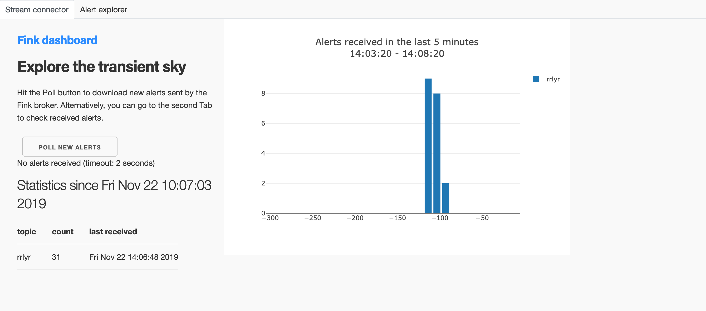
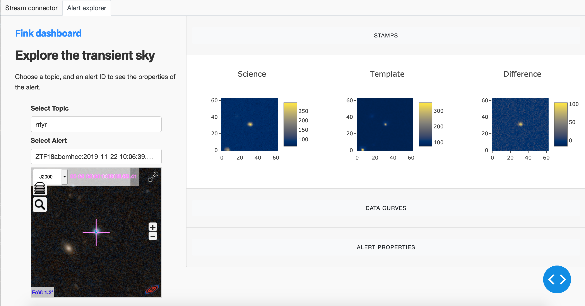
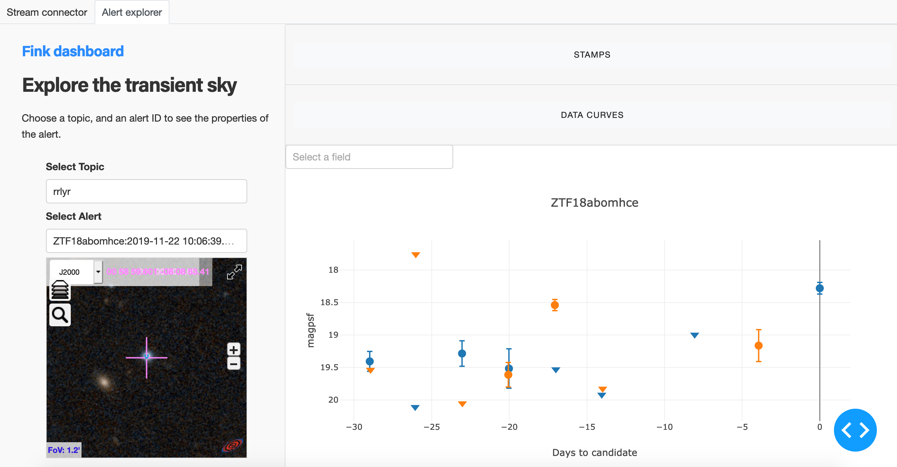
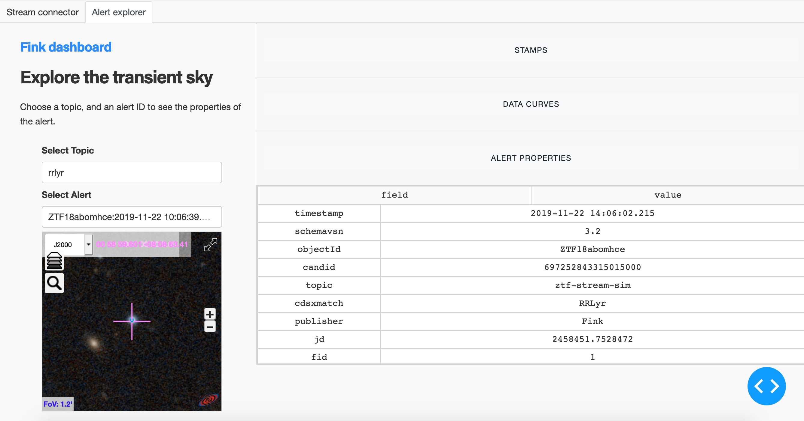

# Connect to Fink streams using fink-client

`fink-client` is a light package to manipulate catalogs and alerts issued from the [fink broker](https://github.com/astrolabsoftware/fink-broker) programmatically.

## Installation

Clone the GitHub repository
```bash
git clone https://github.com/astrolabsoftware/fink-client.git
cd fink-client && export FINK_CLIENT_HOME=$(PWD) >> ~/.bash_profile
```
The above expression will place the environment variable for `$FINK_CLIENT_HOME`
into your `~/.bash_profile` such that this variable should not be required to be set again.

Install `fink_client` dependencies
```bash
pip install --upgrade pip setuptools wheel
pip install -r requirements.txt
```

Run integration test to verify everything is working properly.
```bash
bin/fink_client_test.sh
```
If you don't see any error and all the test results are ok, you have installed it correctly.

## Fink's distribution stream

Fink distributes alerts via Kafka topics based on one or several of the alert properties (label, classification, flux, ...). Topics are created via user-defined filters (see [distribution](../distribution/introduction.md)). You can connect to existing stream, and if you would like to create a new stream, follow the [tutorial](../tutorials/create-filters.md) or raise a new issue in [fink-filters](https://github.com/astrolabsoftware/fink-filters) describing the alert properties and thresholds of interest.

You can connect to one or more of these topics using fink-client's APIs and receive Fink's stream of alerts.
To obtain security credentials for API access and authorization on kafka topics contact Fink's admins.

## Fink client API

Once you have the security credentials for accessing the API, import and instantiate an `AlertConsumer`. The mandatory configurations are `topics`, the security credentials (`username` and `password`) and the `group_id` for which read offsets are stored. You must also give the servers (ip:port) hosting the data: `bootstrap.servers`. They can be set inside the `fink_client/fink_client_conf.py` configuration file.

```python
from fink_client.consumer import AlertConsumer
import fink_client.fink_client_conf as fcc

topics = fcc.topics
config = {
  "username": fcc.username,
  "password": fcc.password,
  "bootstrap.servers": fcc.servers,
  "group_id": fcc.group_id
}

# instantiate a consumer
consumer = AlertConsumer(topics, config)
```

A single alert can be received using the `poll()` method of `AlertConsumer`. The alerts are received as tuple of (topic, alert) of type (str, dict).

```python
# timeout (seconds) can also be defined in the configuration file.
ts = 5  
topic, alert = consumer.poll(timeout=ts)

if alert is not None:
  print("topic: ", topic)
  for key, value in alert.items():
    print("key: {}\t value: {}".format(key, value))
else:
  print(f"no alerts received in {ts} seconds")
```

Multiple alerts can be received using the `consume()` method. The method returns a list of tuples (topic, alert) with maximum `num_alerts` number of alerts.
```python
alerts = counsumer.consume(num_alerts=10, timeout=30)

for topic, alert in alerts:
  print("topic: ", topic)
  print("alert:\n", alert)
```

To consume the alerts in real time one can use the `poll` method in a loop:

```python
# receive alerts in a loop
while True:
  topic, alert = consumer.poll(2)
  print("topic: {}, alert:\n {}".format(topic, alert))
```

Make sure you close the connection, or you can also use the context manager:

```python
from fink_client.consumer import AlertConsumer, AlertError

# Close the connection explicitly
consumer = AlertConsumer(topics, config)
try:
  topic, alert = consumer.poll(5)
  print("topic: {}, alert:\n {}".format(topic, alert))
except AlertError as e:
  print(e)
finally:
  consumer.close()

# Or use context manager
with AlertConsumer(topics, config) as consumer:
  topic, alert = consumer.poll(5)
  print("topic: {}, alert:\n {}".format(topic, alert))
```

## Dashboard

You can also use the dashboard to download the alerts and inspect them directly. You must first registered your credentials in the configuration file, and then launch the web application:

```bash
python3 app.py
Running on http://127.0.0.1:8050/
Debugger PIN: xxx-xxx-xxx
```

The Dashboard has two tabs: one to collect alerts and see some statistics about the number of collected alerts, and the second tab to explore individual alerts. The first tab look like:



Hit the poll button, and if you registered correctly you should see alerts coming from time to time in your defined topics. The second tab allows you to inspect collected alerts in details. Choose a topic name and an alert ID from the dropdown menus on the right, and you will have 3 items displayed on the left:

* Stamps contained in the alerts (observation, template, and difference)
* Data curves, including current and historical measurement over a month of observation (the light curve is shown by default, but you can choose to display any alert property)
* Table with alert properties







We also integrate aladin light, by providing a sky image centered in the alert, with the Simbad database overlayed. You can explore in details by going full screen for each alert:


